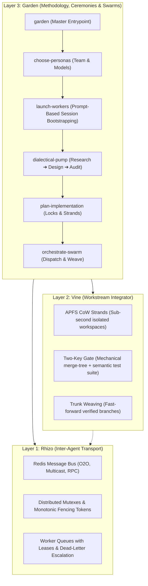

<div align="center">

# Garden

**Multi-Agent Swarm Orchestration, Empirical Dialectics & Ceremonies on top of Rhizo & Vine**

[](LICENSE)
[](https://github.com/axiomantic/rhizo)
[](https://github.com/axiomantic/vine)
[](README.md)
[](README.md)

*Where `rhizo` provides inter-agent transport and `vine` provides workspace virtualization, `garden` provides the institutional intellect, empirical deliberation, and synchronized swarm execution.*

</div>

---

## What is Garden?

**Garden** is an agentic engineering framework and skill library for orchestrating heterogeneous teams of AI coding assistants (Claude Code, OpenCode, Antigravity, Cursor, Codex).

Instead of treating AI agents as isolated single-turn chatbots, Garden provisions **prompt-bootstrapped worker swarms** across your favorite AI coding harnesses (Claude Code, OpenCode, Antigravity, Pi, Cursor), balances specialized personas with designated foundation models, drives **empirically grounded dialectical deliberation**, schedules distributed fencing mutexes, and integrates code through isolated APFS Copy-on-Write strands verified by Vine's Two-Key Gate.



---

## The 5 Core Skills (+ Master Entrypoint)

Garden is organized into a clean, batteries-included catalog of self-explanatory skills:

| Skill | Role | Description |
| :--- | :--- | :--- |
| **[`garden`](skills/garden/SKILL.md)** | **Master Entrypoint** | The sovereign ceremony director. Guides orchestrator and operator step-by-step across all phases from initial task to woven code. |
| **[`choose-personas`](skills/choose-personas/SKILL.md)** | **Team Calibration** | Formulates a balanced triad of specialized personas (e.g. Architect, Auditor, DevEx Lead) with explicitly recommended **coding harnesses** and **model tiers**, confirmed interactively with the operator. |
| **[`launch-workers`](skills/launch-workers/SKILL.md)** | **Session Bootstrapping** | Generates self-contained, 10-backtick raw markdown prompt cards for pasting into separate terminal sessions (Claude Code, OpenCode, Antigravity, Pi). Configures environment variables, registers identities via `rhizo open`, and arms single-shot listeners. |
| **[`dialectical-pump`](skills/dialectical-pump/SKILL.md)** | **Empirical Deliberation** | Drives multi-perspective thesis/antithesis/synthesis debates. Strictly prohibits theatrical roleplay: every turn requires tool execution (reading files, running tests, checking ASTs). Produces `understanding.md`, `design.md`, and `audit_report.md`. |
| **[`plan-implementation`](skills/plan-implementation/SKILL.md)** | **Master Scheduling** | Authors `implementation_plan.md` defining task assignment matrices, `rhizo` distributed fencing locks, `vine` strand workflows, dynamic markdown checkboxes, harness To-Do integration, and emergent design addenda. |
| **[`orchestrate-swarm`](skills/orchestrate-swarm/SKILL.md)** | **Main-Chat Governor** | Governs execution from the primary chat session: dispatches tasks over Redis, tracks heartbeats, ratifies emergent design addenda, verifies Two-Key gate passes, and triggers `vine weave`. |

## Standalone Yet Designed for the Axiomantic Triad

Garden is completely standalone and can direct multi-agent dialectics, persona selection, and prompt-bootstrapped worker swarms on any codebase.

However, Garden is designed from the ground up to pair seamlessly with **Rhizo** and **Vine**:
- [**Rhizo**](https://github.com/axiomantic/rhizo) (Transport & Concurrency): Inter-agent messaging bus, monotonic fencing locks, and task queues over Redis.
- [**Vine**](https://github.com/axiomantic/vine) (Workspaces & Verification): Sub-second APFS Copy-on-Write strands, polyglot build-cache normalization, and the Two-Key integration gate (`git merge-tree` mechanical + compiler/test suite semantic checks).
- **Garden** (Swarm Ceremonies): Prompt-based worker session bootstrapping, 3-stage empirical dialectical pump (research, architecture, audit), and master ceremonial implementation planning.

---

## Installation

### 1. For AI Coding Assistants (Recommended)

Install the skills globally (`-g`) across all your coding assistants (Claude Code, Antigravity, Cursor, Codex, OpenCode, etc.):

```bash
# Recommended: Install the complete multi-agent triad globally
npx skills add -g axiomantic/rhizo
npx skills add -g axiomantic/vine
npx skills add -g axiomantic/garden
```

*(Each skill automatically self-bootstraps its native CLI binary if it is not already installed on your system).*

To install only Garden (includes the 6 Garden skills):
```bash
npx skills add -g axiomantic/garden
```

### 2. Standalone CLI Installation

Install the compiled CLI tools directly onto your `$PATH`:

```bash
# Install all three tools:
npm install -g @axiomantic/rhizo @axiomantic/vine @axiomantic/garden

# Or install Garden alone:
npm install -g @axiomantic/garden
```

> [!TIP]
> **Zero-Install Run via NPX**: In restricted or containerized environments where global installation is unavailable, you can run any command directly without installing:
> ```bash
> npx -y @axiomantic/garden <command>
> ```

### 3. Repository Coordination Guide

Install the Garden multi-agent swarm coordination protocol directly into any project's `AGENTS.md`:
```bash
garden guide install
```

---

## System Prerequisites

1. **`rhizo`** (Coordination Engine):
   ```bash
   npm install -g @axiomantic/rhizo
   ```
2. **`vine`** (Workspace Virtualization Engine):
   ```bash
   npm install -g @axiomantic/vine rift-snapshot
   ```
3. **Redis or Valkey** (local or remote):
   ```bash
   brew install redis && brew services start redis
   ```
4. **`tmux`** (Optional):
   Only required if explicitly running legacy headless panes via `garden launch --tmux`.

---

## 30-Second Quickstart

### 1. Launch Garden on Any Task
In your primary AI coding assistant (Antigravity, Claude Code, OpenCode):

```text
User: "garden: Implement high-throughput batch claim leases with Redis pipeline support"
```

### 2. Interactive Team Calibration (`choose-personas`)
Garden inspects your repository and suggests a balanced persona roster with recommended harnesses and models:
- **Marcus Vance** (Staff Systems Architect) $\to$ **Antigravity** | **Gemini 3.8 Flash**
- **Caleb Thorne** (Refactoring & Code Quality Purist) $\to$ **Claude Code CLI** | **Claude 3 Opus**
- **Elena Rostova** (DevEx & API Lead) $\to$ **Antigravity** | **Gemini 3.8 Flash**

Confirm or adjust the roster with a single click.

### 3. Prompt-Based Swarm Bootstrapping (`launch-workers`)
Garden generates raw markdown prompt cards wrapped in 10 backticks for each worker:
```bash
garden prompts
```
- The operator copies and pastes each prompt block into a separate terminal window or coding harness (Claude Code, OpenCode, Antigravity, Pi, Cursor).
- Each session enters the project directory, sets `RHIZO_AGENT_NAME`, registers on the bus with `rhizo open`, and arms its single-shot listener with `rhizo listen`.
- The Orchestrator verifies readiness via `rhizo who --json` before dispatching tasks.

### 4. The Dialectical Pump (`dialectical-pump`)
The personas deliberate across three empirical stages:
1. **Research**: Workers read code and run tests $\to$ synthesize `understanding.md` $\to$ verify against automated **Fact-Check Gate**.
2. **Architecture**: Triad debates trade-offs $\to$ produces ratified `design.md`.
3. **Audit**: Auditor generates `audit_report.md` $\to$ triad resolves every finding before coding begins.

### 5. Ceremonial Planning (`plan-implementation`)
Garden authors `implementation_plan.md`:
- Schedules distributed fencing locks (`rhizo lock file:<path> --fencing`).
- Assigns tasks and defines APFS CoW strands (`vine new <task_id> --worktree`).
- Sets up dynamic progress checkboxes and harness To-Do tracking.

### 6. Live Orchestration & Trunk Weaving (`orchestrate-swarm`)
The main chat orchestrator dispatches work over Redis. Workers code in isolated strands, run unit tests, and verify the Two-Key Gate (`vine gate`). When passed, the orchestrator executes `vine weave` to fast-forward verified code into `main` with zero merge conflicts!

---

## CLI Reference

| Command | Arguments | Description |
| :--- | :--- | :--- |
| `garden prompts` | `[--worker <name>] [--write [file]] [--json] [--project-dir <dir>] [--swarm-file <file>]` | Generate 10-backtick raw markdown prompt cards for pasting into worker sessions. |
| `garden launch` | `[--worker <name>] [--write [file]] [--json] [--tmux] [--session-name <name>]` | Bootstrap swarm worker sessions (defaults to generating prompt cards). |
| `garden status` | `[--json] [--session-name <name>]` | Telemetry query across active Rhizo agents, listener status, and Vine strands. |
| `garden init` | `[<target_dir>] [--force]` | Initialize `garden.toml`, docs scaffold, and install guide in `AGENTS.md`. |
| `garden teardown`| `[--session-name <name>] [--swarm-file <file>]` | Gracefully close registered swarm agents on the Redis bus. |
| `garden guide` | `<install\|check\|uninstall> [path]` | Install or manage Garden Multi-Agent Swarm Guide in `AGENTS.md`. |

---

## Configuration & Swarm Manifest Reference

> [!TIP]
> For the complete specification of `garden.toml`, `garden-swarm.json` schemas, and environment variables, see the [Garden Configuration & Swarm Manifest Reference](docs/configuration.md).

### Environment Variables

| Variable | Type | Default | Description |
| :--- | :--- | :--- | :--- |
| `GARDEN_SWARM_FILE` | Path | `garden-swarm.json` | Explicit path to swarm manifest JSON file. |
| `GARDEN_CONFIG` | Path | `garden.toml` | Explicit path to project `garden.toml`. |
| `GARDEN_PROJECT_DIR`| Path | *Auto-detected* | Target repository root directory. |
| `GARDEN_TERMINAL_APP`| String | `auto` | Preferred terminal viewer for tmux sessions (`Ghostty`, `Terminal`, `iTerm`, `none`). |

### Example `garden-swarm.json`

```json
{
  "project": "myproject",
  "target_repo": "/Users/developer/Development/myproject",
  "orchestrator": "orchestrator",
  "workers": [
    {
      "name": "architect",
      "persona": "Dr. Marcus Vance (Systems Architect)",
      "role": "Systems Architect & Formal Invariant Specifier",
      "harness": "Claude Code",
      "model": "claude-3-5-sonnet",
      "tags": ["design", "spec"],
      "opposing_priority": "Formal mathematical correctness and zero architectural drift."
    },
    {
      "name": "auditor",
      "persona": "Lyra Sterling (Adversarial Quality Auditor)",
      "role": "Adversarial Code Reviewer & Security Auditor",
      "harness": "OpenCode",
      "model": "gemini-3.8-flash",
      "tags": ["audit", "testing"],
      "opposing_priority": "Aggressive edge-case fault injection and invariant verification."
    },
    {
      "name": "implementer",
      "persona": "Elena Rostova (Lead Implementation Engineer)",
      "role": "Polyglot Systems & Performance Engineer",
      "harness": "Antigravity",
      "model": "claude-3-5-sonnet",
      "tags": ["implementation", "perf"],
      "opposing_priority": "Rapid implementation velocity and minimal dependency footprint."
    }
  ]
}
```

---

## Core Invariants

1. **The Supreme Orchestrator Invariant**:
   The main chat session coordinates, reviews, and integrates. Intensive multi-file edits are executed by the worker fleet in isolated strands.
2. **Empirical Grounding Protocol (Zero Theatrical Dialogue)**:
   Dialectical deliberations must cite hard evidence from real tool calls (line citations, test outputs, compiler errors). Theatrical roleplay is strictly banned.
3. **Two-Key Gate Verification**:
   No code is merged into the trunk without passing both Key 1 (in-memory `git merge-tree` mechanical check) and Key 2 (live semantic compiler and test suite run).
4. **Zero Dirty Commits**:
   All agent identity files, session state, and temporary lockfiles are strictly ignored in `.gitignore`.

---

## License

MIT © Axiomantic / Garden Contributors
