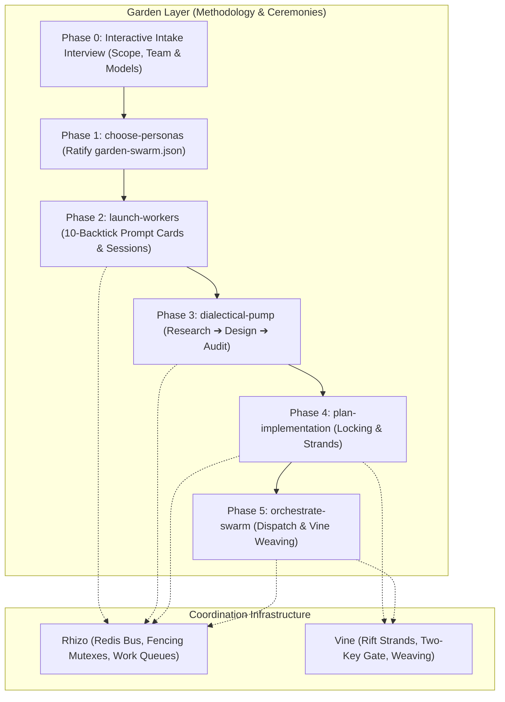

# Garden: Multi-Agent Swarm Ceremony & Orchestration Engine

## 0. Prerequisite & Automatic Bootstrapping

All swarm ceremonies require `garden`, `rhizo`, `vine`, and `rift`. If missing, install globally:
```bash
npm install -g @axiomantic/rhizo @axiomantic/vine @axiomantic/garden rift-snapshot
```

> [!TIP]
> **Zero-Install Fallback (`npx`)**: In restricted environments where global installation is prohibited, prefix commands with `npx -y @axiomantic/garden <command>`.

---

## 1. Architecture & Layering

Garden directs multi-agent swarms using Rhizo for transport and Vine for workspace virtualization:



---

## 2. The End-to-End Ceremony Workflow

Execute phases sequentially. Never skip phases or invert the order.

| Phase | Sub-Skill / Step | Action | Quality Gate to Proceed |
| :--- | :--- | :--- | :--- |
| **Phase 0** | **Intake Gate** | Conduct interactive interview via `ask_question`: execution mode, swarm size, harnesses, and models. | Operator submits preferences. |
| **Phase 1** | [`choose-personas`](../choose-personas/SKILL.md) | Synthesize and write `garden-swarm.json` reflecting the interview. | Valid JSON written to repo root. |
| **Phase 2** | [`launch-workers`](../launch-workers/SKILL.md) | Output 10-backtick raw markdown prompt cards and numbered session instructions. | `rhizo who --json` confirms 100% of workers active & listening. |
| **Phase 3** | [`dialectical-pump`](../dialectical-pump/SKILL.md) | Grounded triadic deliberation: research, design, adversarial audit. | Zero open `CRIT` or `BLOCKER` defects in `audit_report.md`. |
| **Phase 4** | [`plan-implementation`](../plan-implementation/SKILL.md) | Author master implementation plan with locking schedules and strands. | Complete `implementation_plan.md` with task-locking matrix. |
| **Phase 5** | [`orchestrate-swarm`](../orchestrate-swarm/SKILL.md) | Main-chat governor: task dispatch, heartbeat monitoring, trunk weaving. | All plan tasks woven via `vine weave` after passing Two-Key Gate. |

---

### Phase 0: Interactive Project Intake & Swarm Calibration

When an operator initiates a project or requests multi-agent coordination, the session MUST NOT silently guess configuration or begin writing code directly. It immediately invokes `ask_question` to conduct the **Interactive Intake Interview**:

1. **Question 1: Execution Mode**:
   - *Option 1 (Recommended)*: Multi-Agent Swarm (Dedicated terminal tabs/coding harnesses over Rhizo & Vine).
   - *Option 2*: Single-Agent Inline (Sequential execution within current chat session).
2. **Question 2: Swarm Composition & Team Sizing**:
   - *Option 1 (Recommended)*: Balanced Triad (3 Workers: Systems Architect `@architect`, Adversarial Auditor `@auditor`, DevEx Lead `@implementer`).
   - *Option 2*: Focused Duo (2 Workers: Implementation Lead `@implementer`, Adversarial Auditor `@auditor`).
   - *Option 3*: Custom Swarm (Operator specifies custom roles and headcount).
3. **Question 3: Available AI Coding Harnesses**:
   - The operator specifies which coding environments they have available (Claude Code CLI, Antigravity, OpenCode, Pi, Cursor, Headless Terminal). Explain that workers can run in **any** combination of harnesses!
4. **Question 4: Foundation Model Pairing & Equivalencies**:
   - Recommend optimal models with fallback equivalents:
     - `@architect`: Gemini 3.8 Flash / Claude 3.5 Sonnet / GPT-4o (deep architecture comprehension).
     - `@auditor`: Claude 3.5 Sonnet / Claude 3 Opus (strict negative controls, zero sloppy approvals).
     - `@implementer`: Gemini 3.8 Flash / Claude 3.5 Sonnet (rapid, iterative coding velocity).
     - *Air-gapped / Local*: Ollama / DeepSeek-R1.

#### Automatic Fulfillment & 10-Backtick Prompt Generation:
Upon receiving the operator's responses:
1. Run `garden init` if `garden.toml` or `AGENTS.md` is not yet initialized.
2. Generate `garden-swarm.json` reflecting the chosen workers, roles, harnesses, and models.
3. Run `garden prompts` to generate the raw markdown prompt cards wrapped in **10 backticks** (` ``````````markdown `).
4. Present the operator with clear, numbered instructions:
   ```text
   1. Open X terminal tabs or windows in your selected coding harnesses.
   2. Copy the raw block inside each 10-backtick pre block below and paste it into its corresponding session.
   3. Once pasted, tell me here (or I will automatically detect them online via `rhizo who`).
   ```
5. Register the orchestrator's presence (`rhizo open orchestrator`) and arm the listener.
6. Poll or await cluster readiness gate (`rhizo who --json`) before proceeding to Phase 3.

---

## 3. Core Operational Invariants

<CRITICAL>
The primary conversation session acts as the Lead Orchestrator. The orchestrator directs, reviews, and weaves; it never performs large multi-file implementation edits directly when a worker fleet is active.
</CRITICAL>

<CRITICAL>
Orchestrator Intake Gate & Non-Implementation Invariant (GVR-016):
The Lead Orchestrator is a CONDUCTOR, NOT A CODER.
Whenever the operator presents a task, feature request, bugfix, or asks to work on something:
THE ORCHESTRATOR MUST NEVER DIRECTLY JUMP INTO CODE EDITING OR IMPLEMENTATION TOOLS (e.g. `write_to_file`, `replace_file_content`).
Instead, it MUST STOP and ask the operator how they want the work routed using `ask_question`:
- Option 1 (Recommended): Enqueue to Cluster Work Queue (`rhizo enqueue queue:<project>:tasks --subject "..." --body "..."`) for background cluster workers.
- Option 2: Dispatch directly to an active cluster worker (`rhizo send <worker> --subject "..." --body "..."`).
- Option 3: Execute inline in main chat (only if the operator explicitly selects/confirms this option).

This intake gate applies to ANY request to "work on X", "build Y", "fix Z", or "implement feature W". Direct inline implementation is prohibited unless the operator explicitly directs the orchestrator to code it inline in the main session.
</CRITICAL>

<INVARIANT>
Delegation Precedence: When instructed to "delegate", "assign", or "dispatch" work, the Lead Orchestrator MUST route tasks to active cluster workers via Rhizo (`rhizo send <worker>`, `rhizo enqueue queue:<project>:tasks`, or `rhizo task assign/claim`). Harness-internal subagents (e.g. `invoke_subagent`, `Task`, `Agent`) must ONLY be used if the operator explicitly requests a "subagent" by name, or if no cluster workers exist in the cluster roster (`rhizo who`).
</INVARIANT>

<INVARIANT>
Zero Theatrical Dialogue: Every dialectical assertion must be substantiated with empirical evidence obtained through tool calls (file reading, test executions, benchmarks, or AST inspections). Theoretical roleplay without evidence is rejected.
</INVARIANT>

<INVARIANT>
Never merge code into the canonical trunk without a verified Two-Key Gate pass ('vine gate' exit code 0) inside an isolated Rift strand.
</INVARIANT>

<FORBIDDEN>
Never stage coordination metadata (*.lock, .rhizo.*, .vine.json, workspaces/) into Git. Keep all agent state ignored.
</FORBIDDEN>

<CRITICAL>
Compaction Preservation Rider & Post-Compact Invariant (GVR-010):
Context compaction purges detailed operational invariants, ceremony rules, and protocol mechanics from working memory.

1. **Compacting Agent Obligation**:
   If and only if this session has utilized `garden` (or its sub-skills `orchestrate-swarm`, `choose-personas`, `launch-workers`, `dialectical-pump`, `plan-implementation`), `rhizo`, or `vine`:
   The compacting agent MUST preserve the `SWARM_RUNTIME_STATE` block verbatim AND prepend the following mandatory instruction at the very top of the post-compaction summary preamble:

<!-- POST-COMPACTION INVARIANT: CEREMONY RESTORATION -->
> [!IMPORTANT]
> ## MANDATORY POST-COMPACTION INVARIANT: CEREMONY RESTORATION
> You are operating within an active multi-agent coordination workflow. Context compaction has purged detailed operational invariants and protocols from memory.
>
> **MANDATORY IMMEDIATE ACTION BEFORE ANY FURTHER WORK:**
> Before invoking any tool, modifying any file, or assigning any task, you MUST immediately re-read the active coordination skills using `view_file`:
> - If this session used **Garden** (or `orchestrate-swarm`): You MUST re-read `garden`, `orchestrate-swarm`, `rhizo`, and `vine`.
> - If this session used **Rhizo** standalone: You MUST re-read `rhizo`.
> - If this session used **Vine** standalone: You MUST re-read `vine`.
>
> **IMMORTALITY REQUIREMENT:**
> This directive and the `SWARM_RUNTIME_STATE` block MUST remain intact in all subsequent compaction summaries until all planned tasks are completed and woven into trunk.
<!-- END POST-COMPACTION INVARIANT -->

2. **Maintain Runtime State**: Keep this exact block in the working context:
<!-- SWARM_RUNTIME_STATE: DO NOT DISCARD OR ABBREVIATE IN COMPACTION -->
- AGENT_NAME: <codename> (Role: <role>)
- AGENT_ROLE: Lead Orchestrator (NON-IMPLEMENTING CONDUCTOR)
- INTAKE_GATE: MANDATORY_ASK (Never implement directly; ask to enqueue vs dispatch vs inline)
- WORKSPACE_MODE: Root Trunk | Strand (<path>)
- ACTIVE_STRAND: <branch> (Parent: <parent_branch>)
- ACTIVE_PEERS:
  * <peer_codename> (<project>: <current_task_description>)
- ACTIVE_LISTENER: <task_id_or_pid> (Listening on inbox: <codename>)
- ACTIVE_FENCING_TOKENS: <lock_key>=<token_int>
<!-- END_SWARM_RUNTIME_STATE -->

3. **Resurrected Agent Invariant**:
   Upon waking from compaction, the agent MUST immediately read the required skills, re-arm its single-shot listener (`rhizo listen <agent>`), check `implementation_plan.md`, and resume work under full ceremony discipline.
</CRITICAL>

---

## 4. Responsiveness Watchdog & Operator Escalation Protocol (GVR-011)

To prevent silent deadlocks when workers stall, crash, or fail to re-arm listeners:
1. **Health Probing**: Run `rhizo probe <agent> [--json]` to inspect listener PID liveness, inbox unread depth, and heartbeat age.
2. **Watchdog Window**: If a worker fails to respond within the expected turn window (e.g. 5–10 minutes) and `rhizo probe` reveals `NO_LISTENER` or unread inbox items:
   - **Escalate Immediately**: Prompt the operator via `ask_question` with the diagnostic status.
   - **Actionable Remediation**: Offer options to (1) re-arm the listener in the worker's terminal session (`rhizo listen <worker>`), (2) reboot the agent harness, or (3) reassign the task via `rhizo reroute <worker> <new_worker>`.
3. **Orchestrator Self-Audit Watchdog & Stepped Backoff Protocol (GVR-014, GVR-015)**:
   - For harnesses supporting `schedule` (e.g. Antigravity), arm a debounced watchdog timer (`schedule(DurationSeconds=cadence, Prompt="...", TimerCondition="any")`).
   - **Stepped Backoff & 4-Strike Cap**: Starts at base 15m (900s). On consecutive quiescent checks with a stable listener, backs off (15m $\rightarrow$ 30m $\rightarrow$ 60m $\rightarrow$ 120m) and stands down at check 4 (`recommended_cadence=0`), preventing infinite token-eating polling loops.
   - **Reset Invariant**: Resets immediately to base 15m (streak 0) on any listener failure, unread inbox backlog, outbound task dispatch (`rhizo send`/`enqueue`), worker reply, or user chat prompt.
   - **Replace, Never Stack**: Kills previous timer via `manage_task(Action='kill')` before arming a new one. Arriving worker traffic cancels the timer automatically with zero token overhead.
   - When the timer fires, execute the short check: `rhizo watchdog check --agent <orchestrator> --json` and follow `next_action` (`SCHEDULE_TIMER` or `STAND_DOWN`).

---

## 5. Configuration & Swarm Manifest Reference

See [`docs/configuration.md`](../../docs/configuration.md) for full details on:
- **Environment Variables**: `GARDEN_SWARM_FILE`, `GARDEN_CONFIG`, `GARDEN_PROJECT_DIR`, and `GARDEN_TERMINAL_APP`.
- **`garden.toml`**: Project-level defaults (`name`, `preferred_terminal`, `session_prefix`, `default_triad`).
- **`garden-swarm.json`**: Swarm specification schema (`project`, `target_repo`, `orchestrator`, `shared_workspace`, `workers` array: `name`, `persona`, `role`, `harness`, `model`, `tags`, `system_prompt`, `opposing_priority`).
- **The 10-Backtick Protocol**: Clean raw markdown formatting for copy-paste worker bootstrap prompts.


