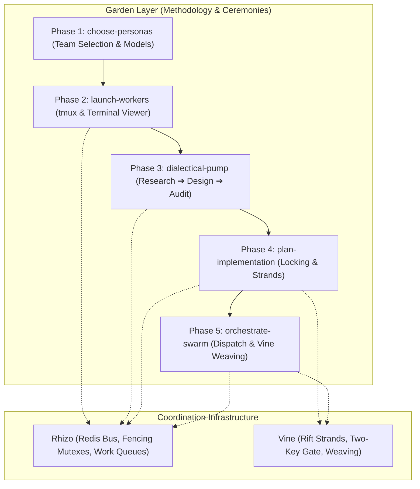

# Garden: Multi-Agent Swarm Ceremony & Orchestration Engine

## 0. Prerequisite & Automatic Bootstrapping

All swarm ceremonies require `garden`, `rhizo`, `vine`, and `rift`. If missing, install globally:
```bash
npm install -g @axiomantic/rhizo @axiomantic/vine @axiomantic/garden rift-snapshot
```

> [!TIP]
> **Zero-Install Fallback (`npx`)**: In restricted environments where global installation is prohibited, prefix commands with `npx -y @axiomantic/garden <command>`.

---

## 1. Architecture & Layering

Garden directs multi-agent swarms using Rhizo for transport and Vine for workspace virtualization:



---

## 2. The 5-Phase End-to-End Ceremony

Execute all five phases sequentially. Never skip phases or invert the order.

| Phase | Sub-Skill | Action | Quality Gate to Proceed |
| :--- | :--- | :--- | :--- |
| **Phase 1** | [`choose-personas`](../choose-personas/SKILL.md) | Formulate 3 balanced personas with harness/model pairings. | Operator ratifies `garden-swarm.json`. |
| **Phase 2** | [`launch-workers`](../launch-workers/SKILL.md) | Provision tmux session, register agents, launch viewer. | `rhizo who --json` confirms 100% of workers active. |
| **Phase 3** | [`dialectical-pump`](../dialectical-pump/SKILL.md) | Grounded triadic deliberation: research, design, adversarial audit. | Zero open `CRIT` or `BLOCKER` defects in `audit_report.md`. |
| **Phase 4** | [`plan-implementation`](../plan-implementation/SKILL.md) | Author master implementation plan with locking schedules and strands. | Complete `implementation_plan.md` with task-locking matrix. |
| **Phase 5** | [`orchestrate-swarm`](../orchestrate-swarm/SKILL.md) | Main-chat governor: task dispatch, heartbeat monitoring, trunk weaving. | All plan tasks woven via `vine weave` after passing Two-Key Gate. |

---

## 3. Core Operational Invariants

<CRITICAL>
The primary conversation session acts as the Supreme Orchestrator. The orchestrator directs, reviews, and weaves; it never performs large multi-file implementation edits directly when a worker fleet is active.
</CRITICAL>

<INVARIANT>
Zero Theatrical Dialogue: Every dialectical assertion must be substantiated with empirical evidence obtained through tool calls (file reading, test executions, benchmarks, or AST inspections). Theoretical roleplay without evidence is rejected.
</INVARIANT>

<INVARIANT>
Never merge code into the canonical trunk without a verified Two-Key Gate pass ('vine gate' exit code 0) inside an isolated Rift strand.
</INVARIANT>

<FORBIDDEN>
Never stage coordination metadata (*.lock, .rhizo.*, .vine.json, workspaces/) into Git. Keep all agent state ignored.
</FORBIDDEN>
