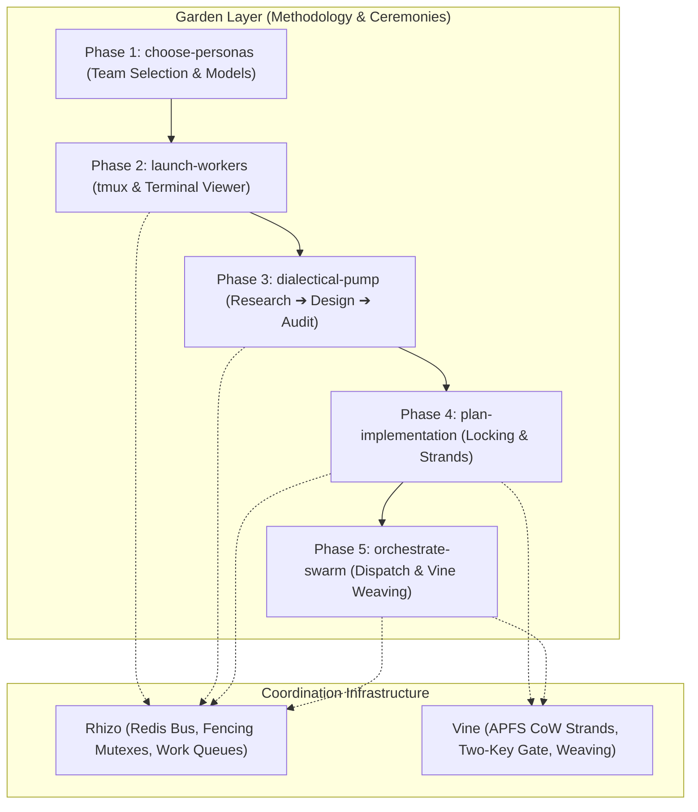
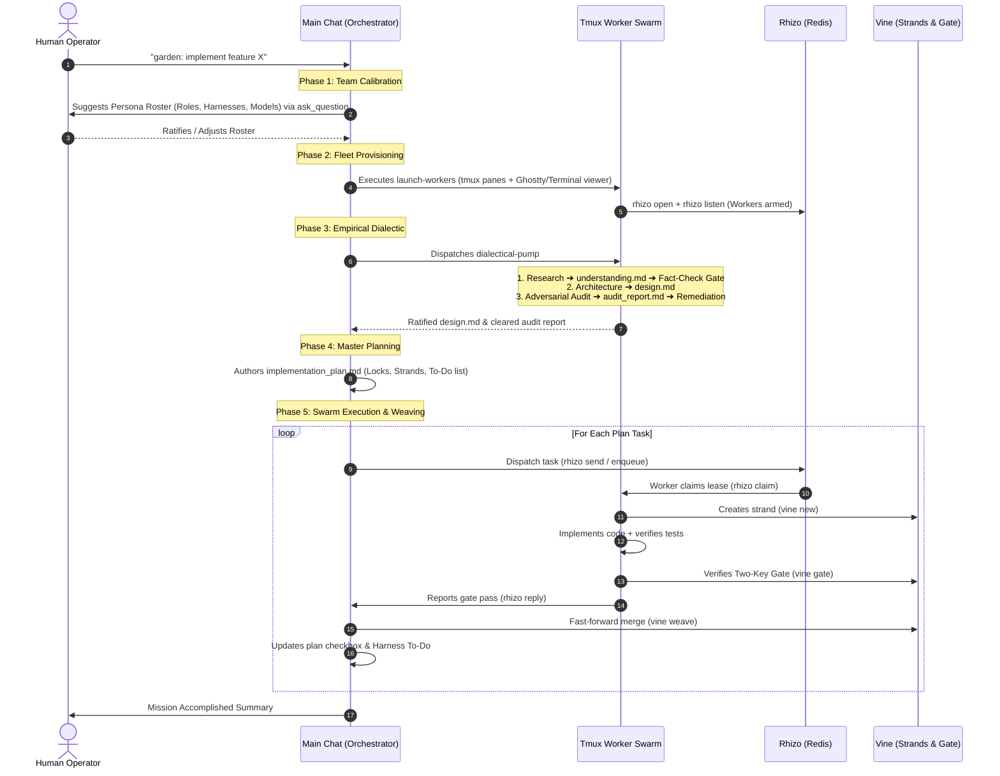

# Garden: Multi-Agent Swarm Ceremony & Orchestration Engine

> **The Sovereign Orchestration Layer for Autonomous AI Swarms**  
> *Where `rhizo` is the transport nervous system and `vine` is the workspace integrator, `garden` is the institutional intellect, deliberation crucible, and master ceremony conductor.*

## 0. Prerequisite & Automatic Bootstrapping

All swarm ceremonies require the native `garden` CLI. If `command -v garden` fails, immediately install it:
```bash
npm install -g @axiomantic/garden
```
Or install the full coordination triad:
```bash
npm install -g @axiomantic/rhizo @axiomantic/vine @axiomantic/garden
```
Once installed, `garden` is available on `$PATH` and provisions architecture-appropriate binaries automatically.

---

## 1. Architectural Architecture & Layering

Garden coordinates teams of heterogeneous AI coding assistants across terminals and machines:



---

## 2. The 5-Phase End-to-End Ceremony

When invoked, the Orchestrator (the primary conversation chat) executes these five phases sequentially. Never skip phases or invert the order.



---

## 3. Phase Transition Protocols & Quality Gates

### Gate 1 $\to$ 2: Persona Ratification Gate
- **Condition**: Operator has confirmed the roster via `ask_question`.
- **Artifact**: `garden-swarm.json` persisted in the project directory.
- **Action**: Call `launch-workers`.

### Gate 2 $\to$ 3: Cluster Readiness Gate
- **Condition**: All worker panes booted, heartbeats active in Redis.
- **Verification**: `rhizo who --json` confirms 100% of agents online and tagged.
- **Action**: Call `dialectical-pump`.

### Gate 3 $\to$ 4: Design Audit Clearance Gate
- **Condition**:
  1. `understanding.md` passed the Fact-Check Gate (zero ungrounded claims).
  2. `design.md` authored and debated by the triadic pump.
  3. `audit_report.md` contains 0 open `CRIT` or `BLOCKER` defects.
- **Action**: Call `plan-implementation`.

### Gate 4 $\to$ 5: Plan Alignment Gate
- **Condition**: `implementation_plan.md` complete with task matrix, locking schedule, vine strand lifecycles, and emergent design addendum protocol.
- **Action**: Call `orchestrate-swarm`.

---

## 4. Sub-Skill Reference Map

When executing Garden, invoke the sub-skills at their designated phases:

| Phase | Skill Name | Description | Primary Artifacts |
| :--- | :--- | :--- | :--- |
| **Phase 1** | [`choose-personas`](../choose-personas/SKILL.md) | Analyzes task, formulates 3 balanced personas with suggested **coding harness** and **model**, and confirms with operator. | `garden-swarm.json` |
| **Phase 2** | [`launch-workers`](../launch-workers/SKILL.md) | Provisions tmux session with worker panes, registers `rhizo open`, arms listeners, and launches OS terminal viewer (Ghostty / Terminal.app). | Live tmux session, visible terminal |
| **Phase 3** | [`dialectical-pump`](../dialectical-pump/SKILL.md) | Drives empirical multi-persona debate grounded in tool calls (file reading, test running, AST inspecting). Produces research, design, and audit docs. | `understanding.md`, `design.md`, `audit_report.md` |
| **Phase 4** | [`plan-implementation`](../plan-implementation/SKILL.md) | Authors master implementation plan detailing task assignments, `rhizo` locks (`--fencing`), `vine` strands, dynamic checkboxes, and To-Do tracking. | `implementation_plan.md` |
| **Phase 5** | [`orchestrate-swarm`](../orchestrate-swarm/SKILL.md) | Main-chat governor: dispatches tasks over Redis, tracks heartbeats, approves emergent design addenda, and executes `vine weave` upon Two-Key gate pass. | Completed code, woven trunk, git commits |

---

## 5. Invariants & Rules of Engagement

1. **The Supreme Orchestrator Invariant**:
   The primary conversation session acts as the Supreme Orchestrator. It coordinates, plans, reviews, and merges. It delegates intensive multi-file edits to the worker fleet.
2. **Zero Theatrical Dialogue**:
   In dialectical deliberations, every assertion must be backed by empirical evidence (line citations, test execution outputs, compiler errors).
3. **No Unmanaged Daemons / Zero Dirty Commits**:
   All coordination metadata (`.rhizo.*`, `.vine.*`, `*.lock`) must remain in `.gitignore`. Workers must adhere to the Two-Key Gate before any code touches the canonical trunk.
