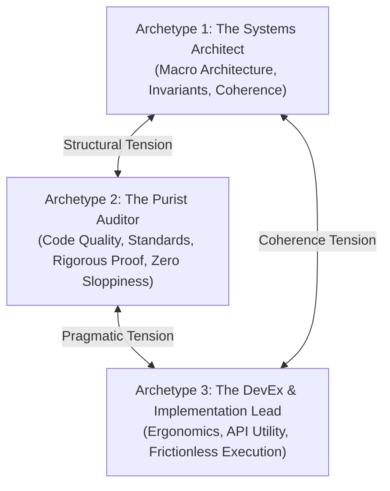
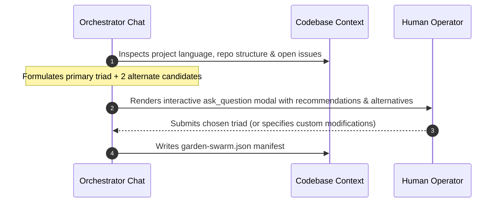

# `choose-personas`: Dynamic Swarm Persona Selection & Harness/Model Pairing

> **Calibrate the Minds Before Booting the Hands**  
> *A multi-agent swarm is only as effective as the diversity, specialization, and cognitive balance of its personas. This skill pairs domain roles with their optimal coding harnesses and foundation models.*

---

## 1. The Triadic Balance Heuristic

Every engineering task benefits from a triad of three distinct, tension-generating archetypes:



1. **The Systems Architect** (e.g., Marcus Vance):
   - **Focus**: Global system topology, invariants, lifecycle management, failure modes, cross-component boundaries.
   - **Bias**: Prefers structural purity and comprehensive conceptual models.
2. **The Purist Auditor / Refactoring Specialist** (e.g., Caleb Thorne / Dr. Vance):
   - **Focus**: Single-source of truth (SSOT), ISO standards compliance, dead-code elimination, zero green mirages, edge-case failure proofs.
   - **Bias**: Adversarial skeptic. Assumes claims are unproven until verified by an automated test or compiler run.
3. **The DevEx & Implementation Lead** (e.g., Elena Rostova):
   - **Focus**: Developer experience, API ergonomics, ease of adoption, idiomatic conventions, pragmatic delivery.
   - **Bias**: Champions the human engineer using the tool; eliminates cognitive overhead and unnecessary friction.

---

## 2. Harness & Model Matching Matrix

When proposing personas, the assistant must explicitly pair each persona with an appropriate **coding harness** and **foundation model**, taking operator preferences into account (defaulting to Antigravity + Gemini 3.8 Flash for rapid implementation, and invoking Claude for deep adversarial auditing):

| Role Mandate | Recommended Harness | Recommended Model Tier | Rationale |
| :--- | :--- | :--- | :--- |
| **Architectural Design & Systems Modeling** | **Antigravity** or **OpenCode** | **Gemini 3.8 Flash** or **Claude 3.5 Sonnet** | Fast token throughput, deep reasoning, superior multi-file architectural comprehension, and native background ear support. |
| **Adversarial Audit & Code Quality Purism** | **Claude Code CLI** | **Claude 3 Opus** or **Claude 3.5 Sonnet** | Uncompromising adherence to instructions, meticulous attention to negative controls, zero tolerance for superficial green tests. |
| **DevEx, Rapid Prototyping & Implementation** | **Antigravity** | **Gemini 3.8 Flash** | Native reactive tool execution (`run_command`), rapid file modification, direct terminal feedback. |
| **Hermetic / Local Security Analysis** | **Headless Terminal Worker** | **Ollama / Local DeepSeek-R1** | Air-gapped execution for proprietary credentials, licensing checks, or sensitive security audits. |

---

## 3. The Calibration Workflow



### Step 1: Codebase & Task Analysis
1. Inspect repository stack (e.g., Nim, Rust, Python, TypeScript, C).
2. Read project `AGENTS.md` and `README.md` to identify existing conventions.
3. Determine task scope:
   - *Refactoring / Technical Debt*: Prioritize Refactoring Purist + Test Auditor.
   - *Greenfield Subsystem*: Prioritize Systems Architect + API Designer.
   - *Security / Compliance*: Prioritize ISO Compliance Auditor + Security Adversary.

### Step 2: Formulate Recommendation & Alternatives
Synthesize the primary triad and at least two alternative candidates:
- **Primary Triad**:
  - Persona 1: Name, Role title, Mandate, Suggested Harness, Suggested Model.
  - Persona 2: Name, Role title, Mandate, Suggested Harness, Suggested Model.
  - Persona 3: Name, Role title, Mandate, Suggested Harness, Suggested Model.
- **Alternative Candidates**:
  - Alternate A: e.g. Performance Benchmarking Engineer.
  - Alternate B: e.g. Documentation & Developer Education Lead.

### Step 3: Interactive Operator Ratification (`ask_question`)
Invoke `ask_question` with structured, selectable options:
- Option 1 (Recommended): Primary Triad (with explicit harnesses and models listed).
- Option 2: Alternative balance (e.g. replacing Purist with Performance Engineer).
- Option 3: Custom configuration (allows user write-in).

### Step 4: Generate Swarm Manifest (`garden-swarm.json`)
Once ratified, write `garden-swarm.json` to the target project directory:

```json
{
  "project": "my-project",
  "created_at": "2026-09-28T12:00:00Z",
  "workers": [
    {
      "name": "architect",
      "persona": "Marcus Vance",
      "role": "Staff Systems Architect",
      "harness": "antigravity",
      "model": "gemini-3-8-flash",
      "tags": ["systems", "architecture", "coordinator"],
      "system_prompt": "You are Marcus Vance, Staff Systems Architect...",
      "startup_command": "rhizo listen architect"
    },
    {
      "name": "auditor",
      "persona": "Caleb Thorne",
      "role": "Code Quality & Refactoring Purist",
      "harness": "claude-code",
      "model": "claude-3-5-sonnet",
      "tags": ["qa", "audit", "purist"],
      "system_prompt": "You are Caleb Thorne, Refactoring Purist...",
      "startup_command": "claude --agent auditor"
    },
    {
      "name": "implementer",
      "persona": "Elena Rostova",
      "role": "DevEx & Implementation Lead",
      "harness": "antigravity",
      "model": "gemini-3-8-flash",
      "tags": ["dev", "devex", "build"],
      "system_prompt": "You are Elena Rostova, DevEx Lead...",
      "startup_command": "rhizo listen implementer"
    }
  ]
}
```

---

## 4. Verification & Handoff

Before concluding:
1. Verify `garden-swarm.json` is syntactically valid JSON.
2. Confirm each worker has unique `name` and non-empty `tags`.
3. Proceed directly to [`launch-workers`](../launch-workers/SKILL.md).
