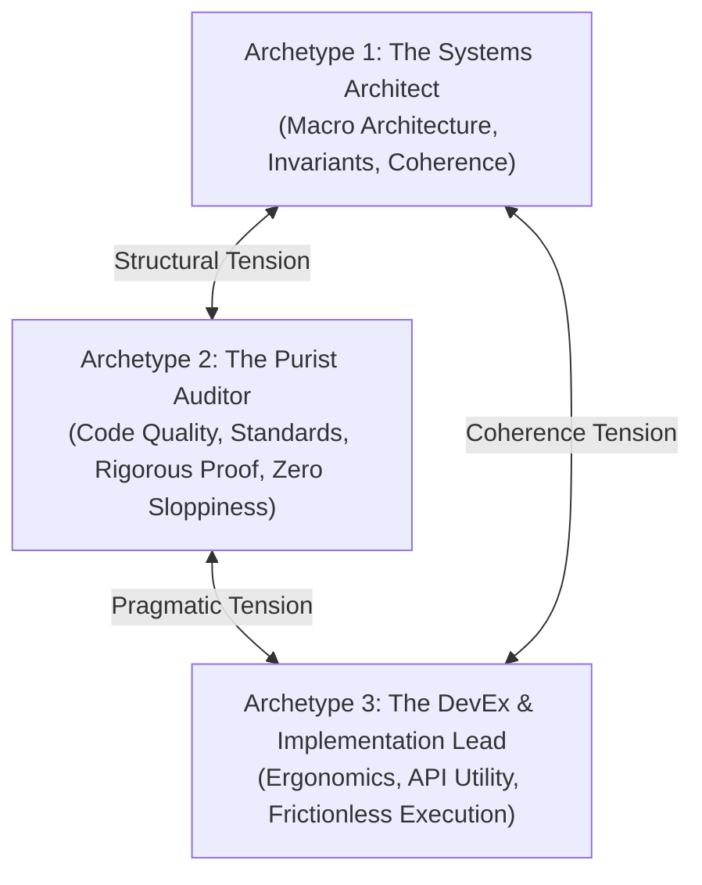

# `choose-personas`: Dynamic Swarm Persona Selection & Harness/Model Pairing

> **Calibrate the Minds Before Booting the Hands**  
> *A multi-agent swarm is only as effective as the diversity, specialization, and cognitive balance of its personas. This skill pairs domain roles with their optimal coding harnesses and foundation models.*

---

## 1. The Triadic Balance Heuristic

Every engineering task benefits from a triad of three distinct, tension-generating archetypes:



1. **The Systems Architect** (e.g., Marcus Vance):
   - **Focus**: Global system topology, invariants, lifecycle management, failure modes, cross-component boundaries.
   - **Bias**: Prefers structural purity and comprehensive conceptual models.
2. **The Purist Auditor / Refactoring Specialist** (e.g., Caleb Thorne / Dr. Vance):
   - **Focus**: Single-source of truth (SSOT), ISO standards compliance, dead-code elimination, zero green mirages, edge-case failure proofs.
   - **Bias**: Adversarial skeptic. Assumes claims are unproven until verified by an automated test or compiler run.
3. **The DevEx & Implementation Lead** (e.g., Elena Rostova):
   - **Focus**: Developer experience, API ergonomics, ease of adoption, idiomatic conventions, pragmatic delivery.
   - **Bias**: Champions the human engineer using the tool; eliminates cognitive overhead and unnecessary friction.

---

## 2. Harness & Model Alignment

Every recommended worker represents an INDEPENDENT, DEDICATED CODING SESSION (separate terminal tab or dedicated IDE window) bootstrapped via Garden 10-backtick prompt cards.

Workers inherit whatever foundation model is native or configured in that session:
- In **Antigravity IDE**: Workers run on Antigravity's active session models (Gemini).
- In **Claude Code CLI**: Workers run on Claude CLI's active models (Claude 3.7 Sonnet).
- In **OpenCode Desktop**: Workers run on models configured in `opencode.json`.
- In **Headless Terminal / Pi**: Workers run on provider CLI configuration.

<CRITICAL>
Sovereign Dedicated Sessions Only (Universal Subagent Prohibition):
Swarm workers are ALWAYS sovereign, independent interactive sessions (separate terminal tabs or dedicated IDE windows) bootstrapped via Garden 10-backtick prompt cards. Harness-internal subagents (e.g. Antigravity's `invoke_subagent`, Claude Code's `Task`, OpenCode subtasks, Cursor sub-composers) are STRICTLY FORBIDDEN from acting as swarm workers. NEVER pair a persona with internal subagents.
</CRITICAL>

<CRITICAL>
Session Default Models (No Cross-Harness Model Quizzes):
Swarm workers operate in sovereign interactive sessions and inherit whatever foundation model is active in that harness session. NEVER present a separate question asking the operator to choose "Foundation Model Pairings", and NEVER present model options that do not correspond to the chosen harness. In `garden-swarm.json` and prompt cards, models default to `"Session Default (active in window/tab)"`.
</CRITICAL>

| Role Mandate | Recommended Harness | Model Alignment | Rationale |
| :--- | :--- | :--- | :--- |
| **Architectural Design & Systems Modeling** | **Antigravity (Dedicated Window)** or **OpenCode (Dedicated Session)** | Session Default (Native in window) | Fast token throughput, deep reasoning, superior multi-file architectural comprehension, and native background ear support. |
| **Adversarial Audit & Code Quality Purism** | **Claude Code CLI (Dedicated Tab)** or **Antigravity (Dedicated Window)** | Session Default (Native in tab/window) | Uncompromising adherence to instructions, meticulous attention to negative controls, zero tolerance for superficial green tests. |
| **DevEx, Rapid Prototyping & Implementation** | **Antigravity (Dedicated Window)** or **OpenCode (Dedicated Session)** | Session Default (Native in window) | Native reactive tool execution (`run_command`), rapid file modification, direct terminal feedback. |
| **Hermetic / Local Security Analysis** | **Headless Terminal Worker (Dedicated Tab)** | Ollama / Local DeepSeek-R1 | Air-gapped execution for proprietary credentials, licensing checks, or sensitive security audits. |

---

## 3. The Calibration Workflow

```mermaid
sequenceDiagram
    autonumber
    participant Orch as Orchestrator Chat
    participant Redis as Rhizo Cluster
    participant Repo as Codebase Context
    participant User as Human Operator

    Orch->>Redis: rhizo who --json (Pre-Flight Check)
    alt Active Workers Found
        Redis-->>Orch: Active workers online
        Note over Orch: Bypasses intake; reuses active cluster workers
    else Zero Workers Online
        Orch->>Repo: Inspects project language, repo structure & open issues
        Note over Orch: Formulates primary triad + harness pairing
        Orch->>User: Renders unified ask_question modal (Team shape + Harness)
        User-->>Orch: Submits chosen triad
        Orch->>Repo: Writes garden-swarm.json manifest
    end
```

### Step 0: Pre-Flight Cluster Check
Run `rhizo who --json` and inspect `garden-swarm.json`. If active, healthy workers already exist in the cluster, skip persona selection and reuse the existing workers.

### Step 1: Codebase & Task Analysis (Cold Starts Only)
1. Inspect repository stack (e.g., Nim, Rust, Python, TypeScript, C).
2. Read project `AGENTS.md` and `README.md` to identify existing conventions.
3. Determine task scope:
   - *Refactoring / Technical Debt*: Prioritize Refactoring Purist + Test Auditor.
   - *Greenfield Subsystem*: Prioritize Systems Architect + API Designer.
   - *Security / Compliance*: Prioritize ISO Compliance Auditor + Security Adversary.

### Step 2: Formulate Unified Recommendation & Alternatives
Synthesize the primary triad paired with target harness environments:
- **Primary Triad**:
  - Persona 1: Marcus Vance, Staff Systems Architect (Invariants, boundaries, structure)
  - Persona 2: Caleb Thorne, Verification & Adversarial Auditor (Negative controls, purism)
  - Persona 3: Elena Rostova, DevEx & Implementation Lead (Velocity, ergonomics)

### Step 3: Interactive Operator Ratification (`ask_question`)
Invoke `ask_question` with unified, selectable options combining team shape and harness:
- Option 1 (Recommended): Balanced Triad in Antigravity IDE (3 dedicated workspace windows, session-native models)
- Option 2: Balanced Triad in Claude Code CLI (3 dedicated terminal tabs)
- Option 3: Balanced Triad in OpenCode (3 dedicated sessions)
- Option 4: Focused Duo (Implementation Lead + Adversarial Auditor in preferred harness)
- Option 5: Custom configuration (allows user write-in).

### Step 4: Generate Swarm Manifest (`garden-swarm.json`)
Once ratified, write `garden-swarm.json` to the target project directory:

```json
{
  "project": "my-project",
  "created_at": "2026-09-28T12:00:00Z",
  "target_repo": "/Users/eek/Development/my-project",
  "orchestrator": "my-project-orchestrator",
  "workers": [
    {
      "name": "my-project-architect",
      "persona": "Marcus Vance",
      "role": "Staff Systems Architect",
      "harness": "Antigravity / Claude Code",
      "model": "Session Default (active in window/tab)",
      "tags": ["my-project", "systems", "architecture", "invariants"],
      "system_prompt": "You are Marcus Vance, Staff Systems Architect for project my-project...",
      "opposing_priority": "Structural purity, invariant guarantees, and long-term maintainability over hasty quick fixes."
    },
    {
      "name": "my-project-auditor",
      "persona": "Caleb Thorne",
      "role": "Verification & Adversarial Auditor",
      "harness": "Claude Code CLI / Antigravity",
      "model": "Session Default (active in window/tab)",
      "tags": ["my-project", "qa", "audit", "verifier", "purist"],
      "system_prompt": "You are Caleb Thorne, Verification & Adversarial Auditor for project my-project...",
      "opposing_priority": "Adversarial skepticism, rigorous negative controls, and proof over convenience."
    },
    {
      "name": "my-project-implementer",
      "persona": "Elena Rostova",
      "role": "DevEx & Implementation Lead",
      "harness": "Antigravity / OpenCode",
      "model": "Session Default (active in window/tab)",
      "tags": ["my-project", "dev", "devex", "build", "implementation"],
      "system_prompt": "You are Elena Rostova, DevEx & Implementation Lead for project my-project...",
      "opposing_priority": "High-velocity implementation, pragmatic delivery, and developer ergonomics."
    }
  ]
}
```

---

## 4. Verification & Automatic Prompt Generation Handoff

Before concluding:
1. Verify `garden-swarm.json` is syntactically valid JSON.
2. Confirm each worker has unique `name` and non-empty `tags`.
3. Proceed directly to [`launch-workers`](../launch-workers/SKILL.md):
   - Call `garden prompts` to generate the 10-backtick raw markdown blocks.
   - Present the operator with numbered terminal tab setup instructions.
   - Await cluster readiness verification via `rhizo who --json`.
