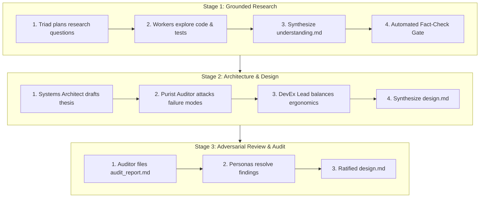

# `dialectical-pump`: Grounded Multi-Persona Deliberation Engine

> **Thesis $\times$ Antithesis $\to$ Empirical Synthesis**  
> *The Dialectical Pump is an epistemic machine. It prevents hallucinated consensus and green mirages by forcing opposing personas to prove every assertion through real tool execution.*

---

## 1. The Core Invariant: Zero Theatrical Dialogue

> [!CAUTION] **STRICT PROHIBITION: Theatrical Dialogue is Rejected**
> A common failure mode in LLM roleplay is generating conversational chit-chat:  
> *"Persona A: I think we should use Redis! Persona B: I agree, but what about memory? Persona A: Good point!"*  
> **This is banned.**

Every turn taken by a persona in the Dialectical Pump must follow the **Empirical Grounding Protocol**:
1. **Tool Invocation**: Every claim must be substantiated by a tool call:
   - Reading exact line numbers: `view_file(AbsolutePath=..., StartLine=..., EndLine=...)`.
   - Running test suites: `run_command(CommandLine="pytest ...")`.
   - Measuring execution or memory: `run_command(CommandLine="time ...")`.
   - Checking git history/diffs: `run_command(CommandLine="git log -S ...")`.
2. **Hard Evidence Citations**: Every critique must cite verifiable evidence:
   - *Prohibited*: "This function looks inefficient."
   - *Mandated*: "Profiling `parsePayload` at `src/resp.nim:88` reveals an allocation of a 64KB temporary string per message; under 10k messages/sec, this triggers 640MB/sec of GC churn as verified by `nimble bench`."

---

## 2. The Three Dialectical Stages

The Dialectical Pump executes across three distinct stages of a project:

---

## 3. Stage 1: Grounded Research & Fact-Check Gate

### Step 1.1: Research Plan Formulation
The triadic personas inspect the assignment and agree on the empirical questions:
- What are the existing invariants in the codebase?
- What dependencies and protocols exist?
- What test suites cover this subsystem?

### Step 1.2: Codebase Exploration
Workers read actual files, verify test suites, and map domain structures.

### Step 1.3: Generate Understanding Document (`understanding.md`)
The triad synthesizes their findings into `understanding.md` containing:
- Domain Glossary & Invariants.
- Data Flow Diagrams.
- Identified Constraints & Technical Debt.

### Step 1.4: The Strict Fact-Check Gate
Before proceeding to design, a dedicated Auditor persona audits `understanding.md`:
- Every file reference must exist (`test -f <path>`).
- Every function signature cited must match reality.
- If any claim is ungrounded or fabricated, the pump repeats Step 1.2 until 100% verified.

---

## 4. Stage 2: Architecture & System Design (`design.md`)

Once research is fact-checked, the pump shifts to product and technical design:

### Step 2.1: The Thesis (Systems Architect)
The Systems Architect proposes the macro architecture:
- Module decomposition.
- Data structures and wire formats.
- Concurrency model and lifecycle states.

### Step 2.2: The Antithesis (Purist Auditor)
The Purist Auditor stress-tests the proposal against concrete failure modes:
- Concurrency race conditions: "What happens if process A dies between lines X and Y?"
- Resource leaks: "Where are file descriptors closed during exception unwinding?"
- Backwards compatibility: "Does this break existing configs or CLI arguments?"

### Step 2.3: The Synthesis (DevEx & Implementation Lead)
The DevEx Lead resolves the dialectic:
- Eliminates unnecessary abstractions that create ergonomics drag.
- Hardens the API contracts.
- Produces the ratified **`design.md`**.

---

## 5. Stage 3: Adversarial Review & Audit Report

### Step 3.1: Forensic Audit Inspection
An Auditor persona performs a line-by-line inspection of `design.md` against single-source truth and ISO standards, generating **`audit_report.md`**:
- Defect codes: `CRIT-01`, `WARN-02`, `DOC-03`.
- Root cause analysis.
- Specific non-prescriptive recommendation options.

### Step 3.2: Remediation & Resolution
The triad meets to address every finding in `audit_report.md`:
- For each defect code: select an option, update `design.md`, and record the resolution in the audit report.
- The gate only clears when **0 critical or blocker defects remain open**.

---

## 6. Output Artifacts

At the conclusion of the Dialectical Pump:
1. `understanding.md` (Grounded and fact-checked).
2. `design.md` (Debated, hardened, and synthesized).
3. `audit_report.md` (All findings addressed and closed).

Proceed immediately to [`plan-implementation`](../plan-implementation/SKILL.md).
