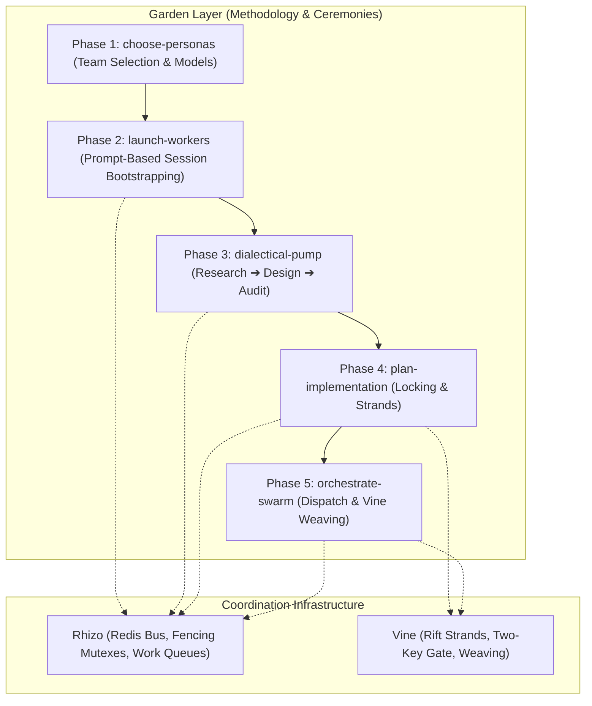

# Garden: Multi-Agent Swarm Ceremony & Orchestration Engine

## 0. Prerequisite & Automatic Bootstrapping

All swarm ceremonies require `garden`, `rhizo`, `vine`, and `rift`. If missing, install globally:
```bash
npm install -g @axiomantic/rhizo @axiomantic/vine @axiomantic/garden rift-snapshot
```

> [!TIP]
> **Zero-Install Fallback (`npx`)**: In restricted environments where global installation is prohibited, prefix commands with `npx -y @axiomantic/garden <command>`.

---

## 1. Architecture & Layering

Garden directs multi-agent swarms using Rhizo for transport and Vine for workspace virtualization:



---

## 2. The 5-Phase End-to-End Ceremony

Execute all five phases sequentially. Never skip phases or invert the order.

| Phase | Sub-Skill | Action | Quality Gate to Proceed |
| :--- | :--- | :--- | :--- |
| **Phase 1** | [`choose-personas`](../choose-personas/SKILL.md) | Formulate 3 balanced personas with harness/model pairings. | Operator ratifies `garden-swarm.json`. |
| **Phase 2** | [`launch-workers`](../launch-workers/SKILL.md) | Generate 10-backtick worker prompt cards for operator pasting into sessions. | `rhizo who --json` confirms 100% of workers active. |
| **Phase 3** | [`dialectical-pump`](../dialectical-pump/SKILL.md) | Grounded triadic deliberation: research, design, adversarial audit. | Zero open `CRIT` or `BLOCKER` defects in `audit_report.md`. |
| **Phase 4** | [`plan-implementation`](../plan-implementation/SKILL.md) | Author master implementation plan with locking schedules and strands. | Complete `implementation_plan.md` with task-locking matrix. |
| **Phase 5** | [`orchestrate-swarm`](../orchestrate-swarm/SKILL.md) | Main-chat governor: task dispatch, heartbeat monitoring, trunk weaving. | All plan tasks woven via `vine weave` after passing Two-Key Gate. |

---

## 3. Core Operational Invariants

<CRITICAL>
The primary conversation session acts as the Supreme Orchestrator. The orchestrator directs, reviews, and weaves; it never performs large multi-file implementation edits directly when a worker fleet is active.
</CRITICAL>

<INVARIANT>
Zero Theatrical Dialogue: Every dialectical assertion must be substantiated with empirical evidence obtained through tool calls (file reading, test executions, benchmarks, or AST inspections). Theoretical roleplay without evidence is rejected.
</INVARIANT>

<INVARIANT>
Never merge code into the canonical trunk without a verified Two-Key Gate pass ('vine gate' exit code 0) inside an isolated Rift strand.
</INVARIANT>

<FORBIDDEN>
Never stage coordination metadata (*.lock, .rhizo.*, .vine.json, workspaces/) into Git. Keep all agent state ignored.
</FORBIDDEN>

<CRITICAL>
Compaction Preservation Rider (GVR-010):
Whenever context summarization or compaction occurs, the coding harness MUST preserve the `SWARM_RUNTIME_STATE` block verbatim in the compacted summary preamble so the agent immediately retains its operational identity, assigned workspace, peers, and active listeners without operator re-prompting.

Maintain this exact block in the working context:
<!-- SWARM_RUNTIME_STATE: DO NOT DISCARD OR ABBREVIATE IN COMPACTION -->
- AGENT_NAME: <codename> (Role: <role>)
- WORKSPACE_MODE: Root Trunk | Strand (<path>)
- ACTIVE_STRAND: <branch> (Parent: <parent_branch>)
- ACTIVE_PEERS:
  * <peer_codename> (<project>: <current_task_description>)
- ACTIVE_LISTENER: <task_id_or_pid> (Listening on inbox: <codename>)
- ACTIVE_FENCING_TOKENS: <lock_key>=<token_int>
<!-- END_SWARM_RUNTIME_STATE -->
</CRITICAL>

---

## 4. Responsiveness Watchdog & Operator Escalation Protocol (GVR-011)

To prevent silent deadlocks when workers stall, crash, or fail to re-arm listeners:
1. **Health Probing**: Run `rhizo probe <agent> [--json]` to inspect listener PID liveness, inbox unread depth, and heartbeat age.
2. **Watchdog Window**: If a worker fails to respond within the expected turn window (e.g. 5–10 minutes) and `rhizo probe` reveals `NO_LISTENER` or unread inbox items:
   - **Escalate Immediately**: Prompt the operator via `ask_question` with the diagnostic status.
   - **Actionable Remediation**: Offer options to (1) re-arm the listener in the worker's terminal session (`rhizo listen <worker>`), (2) reboot the agent harness, or (3) reassign the task via `rhizo reroute <worker> <new_worker>`.
3. **Orchestrator Self-Audit Watchdog & Debouncer Protocol (GVR-014)**:
   - For harnesses supporting `schedule` (e.g. Antigravity), arm a debounced 15-minute watchdog timer (`schedule(DurationSeconds=900, Prompt="...", TimerCondition="any")`).
   - Debouncer replaces (kills previous timer via `manage_task(Action='kill')` before arming a new one) on task dispatch, worker reports, and plan updates ("early and often"). Arriving worker traffic cancels the timer for free with 0 token overhead.
   - When the timer fires, execute the short check: `rhizo watchdog check --agent <orchestrator> --json`. If `ACTION_REQUIRED: REARM_LISTENER`, revive `rhizo listen` in the background and debounce. When all tasks in the plan are complete (`- [x]`), stand down.

---

## 5. Configuration & Swarm Manifest Reference

See [`docs/configuration.md`](../../docs/configuration.md) for full details on:
- **Environment Variables**: `GARDEN_SWARM_FILE`, `GARDEN_CONFIG`, `GARDEN_PROJECT_DIR`, and `GARDEN_TERMINAL_APP`.
- **`garden.toml`**: Project-level defaults (`name`, `preferred_terminal`, `session_prefix`, `default_triad`).
- **`garden-swarm.json`**: Swarm specification schema (`project`, `target_repo`, `orchestrator`, `shared_workspace`, `workers` array: `name`, `persona`, `role`, `harness`, `model`, `tags`, `system_prompt`, `opposing_priority`).
- **The 10-Backtick Protocol**: Clean raw markdown formatting for copy-paste worker bootstrap prompts.


