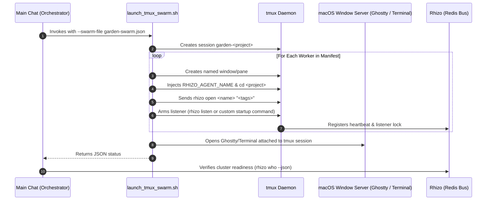

# `launch-workers`: Automated Tmux Swarm Provisioning & Terminal Viewer

> **From Manifest to Live Terminals in Under 2 Seconds**  
> *Tmux multiplexes the background worker processes while OS-level desktop scripting opens your preferred terminal app so you can observe the swarm in real time.*

---

## 1. System Requirements & Invariants

1. **`tmux` is Required**:
   - `tmux 3.0+` must be installed on the host (`command -v tmux`). If missing, fail fast and instruct the operator to install (`brew install tmux`).
2. **`rhizo` is Required**:
   - Rhizo engine must be present (`npm install -g @axiomantic/rhizo`).
3. **No Terminal Fallbacks**:
   - Workers are strictly managed inside tmux windows/panes. We do not detach headless rogue background processes with `nohup` or `&`.
4. **Desktop Viewer Priority on macOS**:
   - Automatically detects installed terminal emulators:
     - **Priority 1: Ghostty** (`/Applications/Ghostty.app`)
     - **Priority 2: iTerm2** (`/Applications/iTerm.app`)
     - **Priority 3: macOS Terminal** (`/System/Applications/Utilities/Terminal.app`)
   - Pops open a visible terminal window running `tmux attach-session -t garden-<project>`.

---

## 2. The Provisioning Flow



---

## 3. Execution Procedure

### Step 1: Run the Swarm Provisioner
Execute [`scripts/launch_tmux_swarm.sh`](file:///Users/eek/Development/garden/scripts/launch_tmux_swarm.sh) with the active project path and manifest:

```bash
/Users/eek/Development/garden/scripts/launch_tmux_swarm.sh \
  --project-dir "$(pwd)" \
  --swarm-file "garden-swarm.json" \
  --force
```

- `--force`: Kills any stale prior session with the same project name before provisioning a clean fleet.
- Automatically launches Ghostty or Terminal.app on macOS attached to the new session.

### Step 2: Verify Cluster Readiness Gate
Before dispatching tasks, verify that every worker from `garden-swarm.json` is actively registered in Redis and displaying valid heartbeats:

```bash
rhizo who --json
```

**Pass Criteria**:
1. All worker names in `garden-swarm.json` appear in `active_agents`.
2. Heartbeats have active TTLs (> 0).
3. Assigned tags match the manifest.

### Step 3: Inspect Terminal Buffer (Health Check)
To check the initial logs or output of any worker without leaving your chat:

```bash
# Capture last 20 lines of worker 'architect' (window 0)
tmux capture-pane -p -t garden-<project>:0 | tail -n 20
```

---

## 4. Teardown & Swarm Cleanup

When the entire project is completed, or when canceling a run:

```bash
# Gracefully deregister all swarm agents from Redis:
for worker in $(python3 -c "import json; [print(w['name']) for w in json.load(open('garden-swarm.json'))['workers']]"); do
  rhizo close "$worker" 2>/dev/null || true
done

# Terminate the tmux session:
tmux kill-session -t garden-<project> 2>/dev/null || true
```
