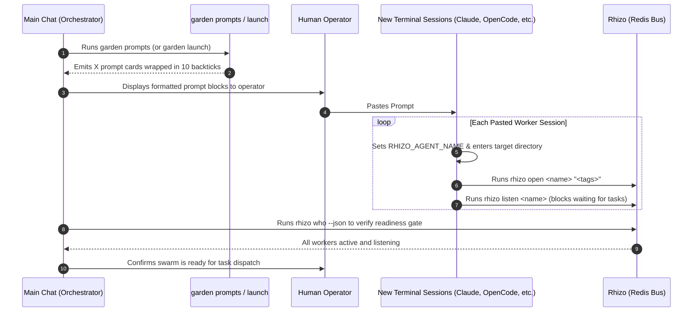

# `launch-workers`: Prompt-Based Swarm Bootstrapping & Work Group Onboarding

> **From Manifest to Coordinated Sessions Across Any AI Harness**  
> *Garden generates self-contained, 10-backtick-fenced prompt cards for the human operator to paste into separate terminal tabs or coding harnesses (Claude Code, OpenCode, Antigravity, Pi, Cursor). Each session is immediately grounded in its identity, joins the Rhizo work group, and arms its listener.*

---

## 1. System Philosophy & Invariants

1. **Human-in-the-Loop Session Autonomy**:
   - We do not blindly spawn tmux background processes or attempt to drive terminal multiplexers with fragile subshell scripting.
   - The operator chooses the harness and model for each worker (e.g. Claude Code CLI in one tab, OpenCode in another, Antigravity in a third).
2. **Raw Markdown 10-Backtick Fencing**:
   <CRITICAL>
   When outputting prompt cards in stdout, artifacts, or chat, every prompt block MUST be wrapped in exactly 10 backticks:
   ``````````markdown
   ...
   ``````````
   This guarantees that nested backtick fences (```bash) and internal markdown headers inside the prompts do NOT prematurely terminate the code block or render markdown, preserving pristine raw text for one-click clipboard copying.
   </CRITICAL>
3. **Single-Shot Listener Discipline**:
   <CRITICAL>
   Inside worker prompts, `rhizo listen <name>` must always be presented as a single-shot, blocking foreground command with zero timeout (infinite wait).
   NEVER wrap `rhizo listen` in a shell loop (`while true; do rhizo listen; done` or `until rhizo listen; do ...`). Loops trap message payloads inside unmonitored subshell logs and hang coordination.
   </CRITICAL>
4. **Worker Autonomous Execution Invariant (GVR-017)**:
   <CRITICAL>
   Swarm workers operate as sovereign, autonomous implementers, not passive chatbots.
   When 'rhizo listen' unblocks and exits, a directive has been delivered!
   Workers MUST NOT wait for operator intervention or ask "Shall I start?".
   They MUST immediately inspect the delivered directive, claim the task, switch to their isolated Vine strand, execute the requested work, verify the Two-Key Gate, report results, and re-arm their single-shot listener.
   </CRITICAL>
5. **Zero Dirty Commits**:
   - Never stage coordination state (`.rhizo.*`, `*.lock`, `.vine.json`, `workspaces/`) into Git.

---

## 2. The Bootstrapping Flow



---

## 3. Execution Procedure

### Step 1: Generate Worker Bootstrap Prompts
Run `garden prompts` (or `garden launch`) from the project root:

```bash
# Output all worker prompts to terminal (and optionally write to file):
garden prompts --write garden-prompts.md

# Or generate for a specific worker:
garden prompts --worker architect
```

If `garden-swarm.json` exists in the repository, Garden uses its configured personas, mandates, harnesses, and models. If missing, Garden automatically synthesizes the standard balanced triad:
- `@architect` (Marcus Vance - Staff Systems Architect)
- `@auditor` (Caleb Thorne - Verification & Adversarial Auditor)
- `@implementer` (Elena Rostova - DevEx & Implementation Lead)

### Step 2: Present & Paste Prompts into Sessions
The Orchestrator presents the generated prompt blocks to the operator with clear, structured guidance:

1. **Numbered Terminal Tab / Session Instructions**:
   Provide a concise setup list instructing the operator on how many sessions to open and which harness/model to configure for each:
   - **Session 1 (@architect)**: e.g. Antigravity or OpenCode with Gemini 3.8 Flash / Claude 3.5 Sonnet $\to$ Paste Card 1
   - **Session 2 (@auditor)**: e.g. Claude Code CLI with Claude 3.5 Sonnet / Claude 3 Opus $\to$ Paste Card 2
   - **Session 3 (@implementer)**: e.g. Antigravity or OpenCode with Gemini 3.8 Flash $\to$ Paste Card 3
2. **Harness & Model Agnostic Flexibility**:
   Explicitly reassure the operator: *"Workers can run in ANY coding harness (Claude Code, OpenCode, Antigravity, Pi, Cursor) and use any equivalent model tier. Coordination occurs strictly over Rhizo (local Redis) and Vine (Rift strands)."*
3. **10-Backtick Raw Markdown Formatting**:
   Ensure every prompt card is displayed inside ` ``````````markdown ` fences so the operator can copy the clean, unrendered text with a single click.
4. **Immediate Autonomous Onboarding**:
   Each prompt instructs the pasted session to immediately:
   - `cd "<project_dir>"`
   - `export RHIZO_AGENT_NAME="<name>"`
   - `rhizo open "<name>" "<tags>"`
   - `rhizo hook install --codex --agent "<name>"` (if running in Codex CLI/Desktop)
   - `rhizo listen "<name>"` (blocking foreground command with infinite wait)
5. **Scheduled Health Check Template (For Codex / Antigravity / Schedulers)**:
   If workers configure a recurring 15-minute listener health check, prompts include the bulletproof 4-step template:
   - STEP 1: Inspect completed subagents/tasks for unhandled delivered tasks and execute them immediately (never stay quiet with pending work).
   - STEP 2: Inspect active tasks to verify a listener is currently running, and re-arm if missing.
   - STEP 3: Run `rhizo probe <name> --json` and drain any inbox backlog.
   - STEP 4: Stay quiet ONLY when a listener is actively running AND no delivered tasks are pending.
6. **Readiness Prompt**:
   Instruct the operator: *"Once you have pasted these prompts and the sessions are listening, tell me here (or I will automatically detect them online via `rhizo who`), and we will proceed to Phase 3 (Dialectical Deliberation)."*

### Step 3: Verify Cluster Readiness Gate
Before dispatching tasks, verify that every worker has registered in Redis and is showing active heartbeats:

```bash
rhizo who --json
```

**Pass Criteria**:
1. All worker codenames from the manifest appear in `active_agents`.
2. Heartbeats have active TTLs (> 0).
3. `rhizo probe <agent>` shows an active listener PID ready to receive work.

---

## 4. Teardown & Swarm Cleanup

When the swarm mission is completed, or when canceling a run:

```bash
# Gracefully deregister all swarm agents from Redis:
garden teardown
```

Or manually:
```bash
for worker in $(python3 -c "import json; [print(w['name']) for w in json.load(open('garden-swarm.json'))['workers']]"); do
  rhizo close "$worker" 2>/dev/null || true
done
```
