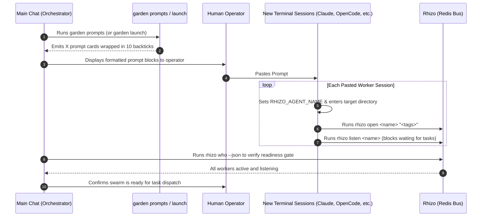

# `launch-workers`: Prompt-Based Swarm Bootstrapping & Work Group Onboarding

> **From Manifest to Coordinated Sessions Across Any AI Harness**  
> *Garden generates self-contained, 10-backtick-fenced prompt cards for the human operator to paste into separate terminal tabs or coding harnesses (Claude Code, OpenCode, Antigravity, Pi, Cursor). Each session is immediately grounded in its identity, joins the Rhizo work group, and arms its listener.*

---

## 1. System Philosophy & Invariants

1. **Human-in-the-Loop Session Autonomy**:
   - We do not blindly spawn tmux background processes or attempt to drive terminal multiplexers with fragile subshell scripting.
   - The operator chooses the harness and model for each worker (e.g. Claude Code CLI in one tab, OpenCode in another, Antigravity in a third).
2. **Raw Markdown 10-Backtick Fencing**:
   <CRITICAL>
   When outputting prompt cards in stdout, artifacts, or chat, every prompt block MUST be wrapped in exactly 10 backticks:
   ``````````markdown
   ...
   ``````````
   This guarantees that nested backtick fences (```bash) and internal markdown headers inside the prompts do NOT prematurely terminate the code block or render markdown, preserving pristine raw text for one-click clipboard copying.
   </CRITICAL>
3. **Single-Shot Listener Discipline**:
   <CRITICAL>
   Inside worker prompts, `rhizo listen <name>` must always be presented as a single-shot, blocking foreground command with zero timeout (infinite wait).
   NEVER wrap `rhizo listen` in a shell loop (`while true; do rhizo listen; done` or `until rhizo listen; do ...`). Loops trap message payloads inside unmonitored subshell logs and hang coordination.
   </CRITICAL>
4. **Worker Autonomous Execution Invariant (GVR-017)**:
   <CRITICAL>
   Swarm workers operate as sovereign, autonomous implementers, not passive chatbots.
   When 'rhizo listen' unblocks and exits, a directive has been delivered!
   Workers MUST NOT wait for operator intervention or ask "Shall I start?".
   They MUST immediately inspect the delivered directive, claim the task, switch to their isolated Vine strand, execute the requested work, verify the Two-Key Gate, report results, and re-arm their single-shot listener.
   </CRITICAL>
5. **Zero Dirty Commits**:
   - Never stage coordination state (`.rhizo.*`, `*.lock`, `.vine.json`, `workspaces/`) into Git.
6. **Sovereign Dedicated Session Invariant (Universal Subagent Prohibition)**:
   <CRITICAL>
   Swarm workers are ALWAYS sovereign, independent interactive sessions (separate terminal tabs or IDE windows) bootstrapped via Garden 10-backtick prompt cards. Harness-internal subagents (e.g. Antigravity's `invoke_subagent`, Claude Code's `Task`, OpenCode subtasks, Cursor sub-composers) are STRICTLY FORBIDDEN from acting as swarm workers. Prompt cards are generated strictly for human operators to paste into separate sessions. The orchestrator must NEVER attempt to automate prompt cards by feeding them into internal subagents.
   </CRITICAL>

---

## 2. The Bootstrapping Flow



---

## 3. Execution Procedure

### Step 1: Generate Worker Bootstrap Prompts
Run `garden prompts` (or `garden launch`) from the project root:

```bash
# Output all worker prompts to terminal (and optionally write to file):
garden prompts --write garden-prompts.md

# Or generate for a specific worker:
garden prompts --worker <project>-architect  # (or suffix shorthand: --worker architect)
```

If `garden-swarm.json` exists in the repository, Garden uses its configured personas, mandates, harnesses, and models. If missing, Garden automatically synthesizes the standard balanced triad:
- `@<project>-architect` (Marcus Vance - Staff Systems Architect)
- `@<project>-auditor` (Caleb Thorne - Verification & Adversarial Auditor)
- `@<project>-implementer` (Elena Rostova - DevEx & Implementation Lead)

### Step 2: Present & Paste Prompts into Sessions
The Orchestrator presents the generated prompt blocks to the operator with clear, structured guidance:

1. **Numbered Terminal Tab / Session Instructions**:
   Provide a concise setup list instructing the operator on how many sessions to open and which harness/model to configure for each:
   - **Session 1 (@<project>-architect)**: e.g. Antigravity IDE (Window 1) or Claude Code CLI (Tab 1) $\to$ Paste Card 1
   - **Session 2 (@<project>-auditor)**: e.g. Claude Code CLI (Tab 2) or Antigravity IDE (Window 2) $\to$ Paste Card 2
   - **Session 3 (@<project>-implementer)**: e.g. Antigravity IDE (Window 3) or OpenCode $\to$ Paste Card 3
2. **Harness & Model Agnostic Flexibility**:
   Explicitly reassure the operator: *"Workers can run in ANY coding harness (Antigravity, Claude Code, OpenCode, Pi, Cursor) and inherit the active model configured in that window/session. Coordination occurs strictly over Rhizo (local Redis) and Vine (Rift strands)."*
3. **10-Backtick Raw Markdown Formatting**:
   Ensure every prompt card is displayed inside ` ``````````markdown ` fences so the operator can copy the clean, unrendered text with a single click.
4. **Immediate Autonomous Onboarding**:
   Each prompt instructs the pasted session to immediately:
   - `cd "<project_dir>"`
   - `export RHIZO_AGENT_NAME="<name>"`
   - `rhizo open "<name>" "<tags>"`
   - `rhizo hook install --codex --agent "<name>"` (if running in Codex CLI/Desktop)
   - `rhizo listen "<name>"` (blocking foreground command with infinite wait)
5. **Scheduled Health Check Template (ONLY for OpenAI Codex / ChatGPT CLI)**:
   In Google Antigravity (using background `run_command`) and OpenCode (using background ear), DO NOT configure scheduled tasks; reactive background process completion handles wakeups natively.
   In Codex Desktop / CLI where sessions cannot wake from background process exits without external stimulation, prompts include the bulletproof 4-step template:
   - STEP 1: Inspect completed subagents/tasks for unhandled delivered tasks and execute them immediately (never stay quiet with pending work).
   - STEP 2: Inspect active tasks to verify a listener is currently running, and re-arm if missing.
   - STEP 3: Run `rhizo probe <name> --json` and drain any inbox backlog.
   - STEP 4: Stay quiet ONLY when a listener is actively running AND no delivered tasks are pending.
6. **Readiness Prompt**:
   Instruct the operator: *"Once you have pasted these prompts and the sessions are listening, tell me here (or I will automatically detect them online via `rhizo who`), and we will proceed to Phase 3 (Dialectical Deliberation)."*

### Step 3: Verify Cluster Readiness Gate
Before dispatching tasks, verify that every worker has registered in Redis and is showing active heartbeats:

```bash
rhizo who --json
```

**Pass Criteria**:
1. All worker codenames from the manifest appear in `active_agents`.
2. Heartbeats have active TTLs (> 0).
3. `rhizo probe <agent>` shows an active listener PID ready to receive work.

---

## 4. Teardown & Swarm Cleanup

When the swarm mission is completed, or when canceling a run:

```bash
# Gracefully deregister all swarm agents from Redis:
garden teardown
```

Or manually:
```bash
for worker in $(python3 -c "import json; [print(w['name']) for w in json.load(open('garden-swarm.json'))['workers']]"); do
  rhizo close "$worker" 2>/dev/null || true
done
```

---

## Unified Work Item State Machine (WISM)

Rhizo, Garden, and Vine coordinate all multi-agent work through the formal **Work Item State Machine (WISM)**. Every task progresses through 10 deterministic states with atomic Redis transitions, automated DAG unblocking, and Two-Key integration gates.

```mermaid
stateDiagram-v2
    [*] --> DRAFTED : rhizo task create <id>
    DRAFTED --> BLOCKED : Unmet DAG dependencies (depends_on)
    DRAFTED --> QUEUED : Zero unmet dependencies
    BLOCKED --> QUEUED : Parent task COMPLETED (Auto-promoted by Lua engine)

    QUEUED --> DELIVERED : Listener pops message (Transport Receipt emitted)
    DELIVERED --> CLAIMED : Worker acknowledges (Acquires monotonic lease)
    DELIVERED --> ORPHANED : Receipt timeout (180s without claim)

    CLAIMED --> IN_PROGRESS : Worker provisions strand (vine new <id>)
    IN_PROGRESS --> IN_PROGRESS : Progress reported (rhizo task progress, lease extended)
    IN_PROGRESS --> GATE_EVALUATING : Verification initiated (vine gate)
    IN_PROGRESS --> YIELDED : rhizo task yield (Returned to pool)
    IN_PROGRESS --> ORPHANED : Lease expires without progress

    GATE_EVALUATING --> IN_PROGRESS : Gate failed (Tests red or merge conflict)
    GATE_EVALUATING --> READY_TO_WEAVE : Two-Key Gate PASSED (Cryptographic gate token stamped)

    READY_TO_WEAVE --> COMPLETED : vine weave && rhizo task complete (Unblocks downstream DAG children)

    ORPHANED --> QUEUED : Re-queued for retry (attempts < 3)
    ORPHANED --> DEAD_LETTER : Max delivery retries exceeded (attempts >= 3)
    YIELDED --> QUEUED : Returned to pool

    COMPLETED --> [*]
    DEAD_LETTER --> [*]
```



### ASCII State Transition Reference (LLM Fast-Path)

```text
  [rhizo task create]
          │
          ▼
     +---------+      Unmet deps
     | DRAFTED | ──────────────────► [ BLOCKED ]
     +---------+                         │
          │ Zero deps                    │ Parent task COMPLETED
          ▼                              ▼
     +---------+ ◄───────────────────────+
     | QUEUED  |
     +---------+
          │
          │ rhizo listen pops task (Transport Receipt emitted)
          ▼
    +-----------+      180s Receipt Timeout
    | DELIVERED | ─────────────────────────────────► [ ORPHANED ]
    +-----------+                                          │
          │                                                │ Attempts >= 3
          │ rhizo task claim / rhizo reply                 ▼
          ▼                                         [ DEAD_LETTER ]
     +---------+
     | CLAIMED |
     +---------+
          │
          │ vine new <task_id> (Provision strand)
          ▼
   +-------------+      Lease expires
   | IN_PROGRESS | ────────────────────────────────► [ ORPHANED ]
   +-------------+
     │        ▲
     │ vine   │ Gate fails
     │ gate   │ (Tests red or conflict)
     ▼        │
  +-----------------+
  | GATE_EVALUATING |
  +-----------------+
          │
          │ Two-Key Gate PASSED (Key 1 merge-tree + Key 2 live test suite green)
          ▼
  +----------------+
  | READY_TO_WEAVE |
  +----------------+
          │
          │ vine weave && rhizo task complete
          ▼
    +-----------+
    | COMPLETED | ──► Auto-promotes BLOCKED child tasks to QUEUED!
    +-----------+
```

### State Definitions & Invariants

| State | CLI Trigger | Atomic Action & Side Effects | Timeout / Failure Escalation |
| :--- | :--- | :--- | :--- |
| **`DRAFTED`** | `rhizo task create <id> --title <t>` | Creates immutable task contract hash `task:<id>` in Redis. | N/A |
| **`BLOCKED`** | Evaluated on create | Stamped if `depends_on` contains incomplete tasks. Workers cannot claim. | N/A |
| **`QUEUED`** | Auto on create or parent complete | Pushed to queue/inbox. Available for worker consumption. | N/A |
| **`DELIVERED`** | `rhizo listen` consumes payload | **Atomically moves into `task:<id>` DELIVERED state**. Instant transport receipt emitted to orchestrator. Mirrored to local `~/.config/rhizo/current_task.json` for turn-end hook interlocks. | 180s Receipt Timeout $
ightarrow$ `ORPHANED` |
| **`CLAIMED`** | `rhizo task claim <id>` / `rhizo reply` | Worker acquires monotonic fencing lease. Isolated Vine strand provisioned (`vine new <id>`). Turn-end hook blocks until work starts. | Lease expires $
ightarrow$ `ORPHANED` |
| **`IN_PROGRESS`** | Worker coding in strand | Enforces single-active-lease invariant. Periodic `rhizo task progress` extends lease. | Lease expires $
ightarrow$ `ORPHANED` |
| **`GATE_EVALUATING`**| `vine gate` | Key 1 (mechanical merge-tree) & Key 2 (live compiler/test suite) evaluated. | Exit 1 $
ightarrow$ `CONFLICTED`<br>Exit 2 $
ightarrow$ `GATE_FAILED` |
| **`READY_TO_WEAVE`** | Both keys pass 100% | Cryptographic gate token stamped (`gate_token`). Report sent to orchestrator. | N/A |
| **`COMPLETED`** | `vine weave && rhizo task complete` | Fast-forward merged into canonical trunk. Strand pruned. Locks released. **Downstream DAG dependencies automatically unblocked (`BLOCKED` $
ightarrow$ `QUEUED`)!** | N/A |
| **`ORPHANED`** | Receipt timeout or lease expired | Stalled worker detected. Increments `delivery_attempts`. If $\ge 3 
ightarrow$ `DEAD_LETTER`. Otherwise returns to `QUEUED`. | Escalates to operator if Dead-Lettered |
| **`YIELDED`** | `rhizo task yield <id>` | Worker gracefully steps aside. Task returned to `QUEUED`. | N/A |
| **`DEAD_LETTER`** | Retries exhausted ($\ge 3$) | Moved to dead-letter queue. Alerts orchestrator and operator. | Requires manual operator triage |

