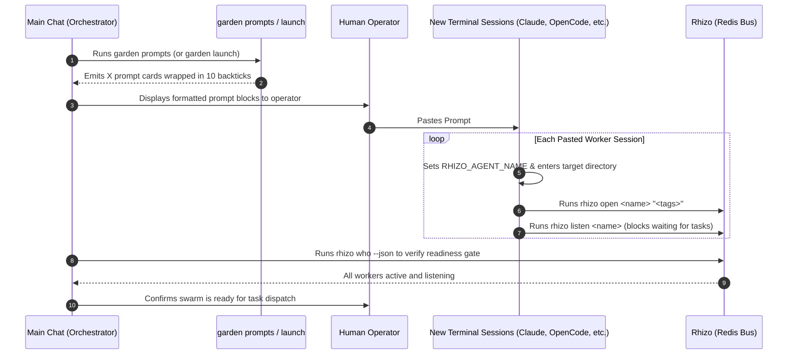

# `launch-workers`: Prompt-Based Swarm Bootstrapping & Work Group Onboarding

> **From Manifest to Coordinated Sessions Across Any AI Harness**  
> *Garden generates self-contained, 10-backtick-fenced prompt cards for the human operator to paste into separate terminal tabs or coding harnesses (Claude Code, OpenCode, Antigravity, Pi, Cursor). Each session is immediately grounded in its identity, joins the Rhizo work group, and arms its listener.*

---

## 1. System Philosophy & Invariants

1. **Human-in-the-Loop Session Autonomy**:
   - We do not blindly spawn tmux background processes or attempt to drive terminal multiplexers with fragile subshell scripting.
   - The operator chooses the harness and model for each worker (e.g. Claude Code CLI in one tab, OpenCode in another, Antigravity in a third).
2. **Raw Markdown 10-Backtick Fencing**:
   <CRITICAL>
   When outputting prompt cards in stdout, artifacts, or chat, every prompt block MUST be wrapped in exactly 10 backticks:
   ``````````markdown
   ...
   ``````````
   This guarantees that nested backtick fences (```bash) and internal markdown headers inside the prompts do NOT prematurely terminate the code block or render markdown, preserving pristine raw text for one-click clipboard copying.
   </CRITICAL>
3. **Single-Shot Listener Discipline**:
   <CRITICAL>
   Inside worker prompts, `rhizo listen <name>` must always be presented as a single-shot, blocking foreground command with zero timeout (infinite wait).
   NEVER wrap `rhizo listen` in a shell loop (`while true; do rhizo listen; done` or `until rhizo listen; do ...`). Loops trap message payloads inside unmonitored subshell logs and hang coordination.
   </CRITICAL>
4. **Zero Dirty Commits**:
   - Never stage coordination state (`.rhizo.*`, `*.lock`, `.vine.json`, `workspaces/`) into Git.

---

## 2. The Bootstrapping Flow



---

## 3. Execution Procedure

### Step 1: Generate Worker Bootstrap Prompts
Run `garden prompts` (or `garden launch`) from the project root:

```bash
# Output all worker prompts to terminal (and optionally write to file):
garden prompts --write garden-prompts.md

# Or generate for a specific worker:
garden prompts --worker architect
```

If `garden-swarm.json` exists in the repository, Garden uses its configured personas, mandates, harnesses, and models. If missing, Garden automatically synthesizes the standard balanced triad:
- `@architect` (Marcus Vance - Staff Systems Architect)
- `@auditor` (Caleb Thorne - Verification & Adversarial Auditor)
- `@implementer` (Elena Rostova - DevEx & Implementation Lead)

### Step 2: Present & Paste Prompts into Sessions
The operator opens a separate terminal window, tab, or harness session for each worker, then copies and pastes the corresponding raw block from the 10-backtick pre block.

Each prompt immediately instructs the agent to:
1. `cd "<project_dir>"`
2. `export RHIZO_AGENT_NAME="<name>"`
3. `rhizo open "<name>" "<tags>"`
4. `rhizo listen "<name>"` (blocking until the Orchestrator delivers a task)

### Step 3: Verify Cluster Readiness Gate
Before dispatching tasks, verify that every worker has registered in Redis and is showing active heartbeats:

```bash
rhizo who --json
```

**Pass Criteria**:
1. All worker codenames from the manifest appear in `active_agents`.
2. Heartbeats have active TTLs (> 0).
3. `rhizo probe <agent>` shows an active listener PID ready to receive work.

---

## 4. Teardown & Swarm Cleanup

When the swarm mission is completed, or when canceling a run:

```bash
# Gracefully deregister all swarm agents from Redis:
garden teardown
```

Or manually:
```bash
for worker in $(python3 -c "import json; [print(w['name']) for w in json.load(open('garden-swarm.json'))['workers']]"); do
  rhizo close "$worker" 2>/dev/null || true
done
```
