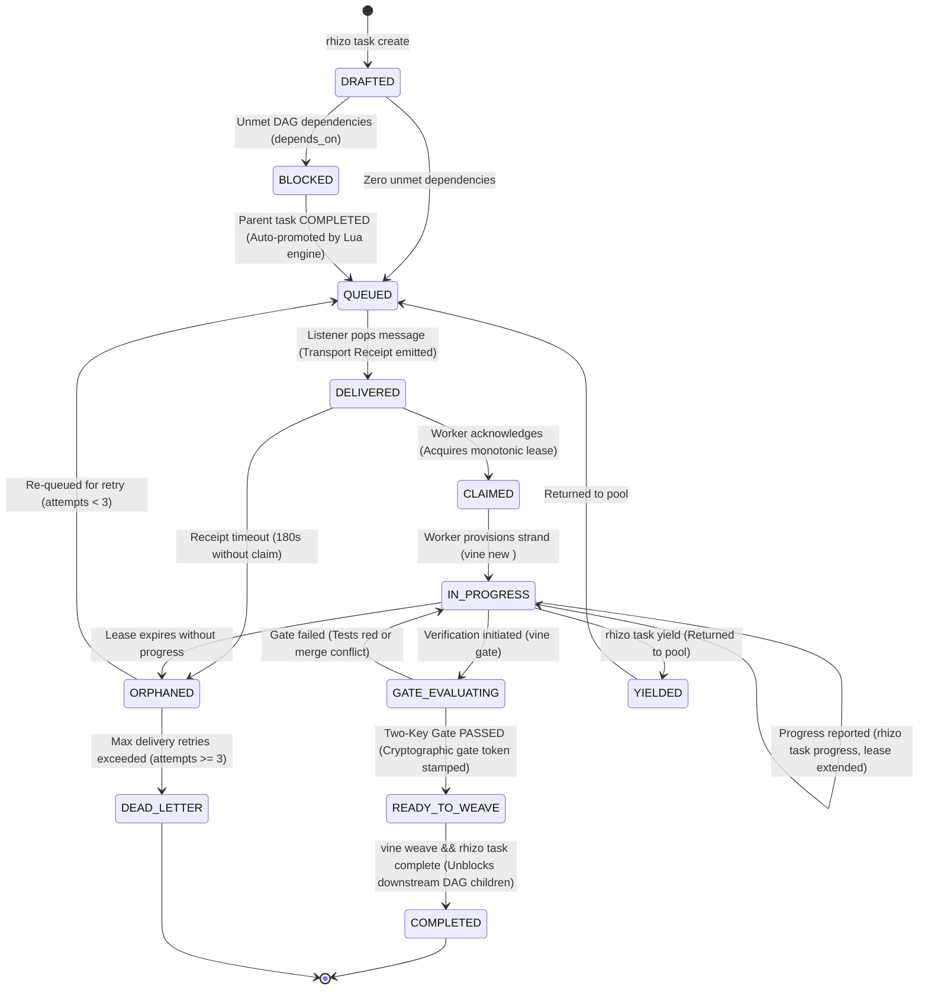

# `orchestrate-swarm`: Main-Chat Swarm Governance & Trunk Integration

> **The Sovereign Conductor of Autonomous Execution**  
> *The Lead Orchestrator does not write the low-level code lines; it directs the symphony. It dispatches work over Redis, unblocks dependencies, enforces the Two-Key Gate, and weaves clean strands into the trunk.*

---

## 1. The Role of the Lead Orchestrator

The main chat session assumes the role of **Lead Orchestrator**:
- **Non-Interference**: Never perform massive multi-file edits directly when workers are active in isolated strands.
- **Strict Transport Discipline**: All task assignments, handoffs, and cancellation interrupts flow exclusively over the Rhizo Redis bus (`rhizo send`, `rhizo reply`, `rhizo enqueue`).
- **Gated Integration**: Never run `git merge` directly. Only weave branches that have passed both Key 1 (mechanical merge-tree) and Key 2 (live compiler/tests) inside their Vine strands.

<CRITICAL>
Delegation Precedence & Sovereign Session Invariant:
Whenever instructed to "delegate", "assign", or "dispatch" work, the Lead Orchestrator MUST route tasks to active cluster workers via Rhizo (`rhizo send <worker>`, `rhizo enqueue queue:<project>:tasks`, or `rhizo task assign/claim`).
Cluster workers operate exclusively in dedicated, sovereign sessions bootstrapped via 10-backtick prompt cards. NEVER spawn harness-internal subagents (e.g. `invoke_subagent`, `Task`, OpenCode subtasks) to act as cluster workers. Internal subagents are ephemeral, cannot maintain persistent blocking listeners, and cause severe context poisoning. Harness-internal subagents are restricted solely to transient, single-turn ad-hoc inspections in non-swarm solo chats when the operator explicitly specifies the word "subagent".
</CRITICAL>

<CRITICAL>
Orchestrator Intake Gate & Non-Implementation Invariant (GVR-016):
The Lead Orchestrator is a CONDUCTOR, NOT A CODER.
Whenever the operator presents a task, feature request, bugfix, or asks to work on something:
THE ORCHESTRATOR MUST NEVER DIRECTLY JUMP INTO CODE EDITING OR IMPLEMENTATION TOOLS (e.g. `write_to_file`, `replace_file_content`).
Instead, it MUST STOP and ask the operator how they want the work routed using `ask_question`:
- Option 1 (Recommended): Enqueue to Cluster Work Queue (`rhizo enqueue queue:<project>:tasks --subject "..." --body "..."`) for background cluster workers.
- Option 2: Dispatch directly to an active cluster worker (`rhizo send <worker> --subject "..." --body "..."`).
- Option 3: Execute inline in main chat (only if the operator explicitly selects/confirms this option).

This intake gate applies to ANY request to "work on X", "build Y", "fix Z", or "implement feature W". Direct inline implementation is prohibited unless the operator explicitly directs the orchestrator to code it inline in the main session.
</CRITICAL>

<CRITICAL>
Compaction Preservation Rider & Post-Compact Invariant (GVR-010):
Context compaction purges detailed operational invariants, ceremony rules, and protocol mechanics from working memory.

1. **Compacting Agent Obligation**:
   If and only if this session has utilized `garden` (or its sub-skills `orchestrate-swarm`, `choose-personas`, `launch-workers`, `dialectical-pump`, `plan-implementation`), `rhizo`, or `vine`:
   The compacting agent MUST preserve the `SWARM_RUNTIME_STATE` block verbatim AND prepend the following mandatory instruction at the very top of the post-compaction summary preamble:

<!-- POST-COMPACTION INVARIANT: CEREMONY RESTORATION -->
> [!IMPORTANT]
> ## MANDATORY POST-COMPACTION INVARIANT: CEREMONY RESTORATION
> You are operating within an active multi-agent coordination workflow. Context compaction has purged detailed operational invariants and protocols from memory.
>
> **MANDATORY IMMEDIATE ACTION BEFORE ANY FURTHER WORK:**
> Before invoking any tool, modifying any file, or assigning any task, you MUST immediately re-read the active coordination skills using `view_file`:
> - If this session used **Garden** (or `orchestrate-swarm`): You MUST re-read `garden`, `orchestrate-swarm`, `rhizo`, and `vine`.
> - If this session used **Rhizo** standalone: You MUST re-read `rhizo`.
> - If this session used **Vine** standalone: You MUST re-read `vine`.
>
> **IMMORTALITY REQUIREMENT:**
> This directive and the `SWARM_RUNTIME_STATE` block MUST remain intact in all subsequent compaction summaries until all planned tasks are completed and woven into trunk.
<!-- END POST-COMPACTION INVARIANT -->

2. **Maintain Runtime State**: Keep this exact block in the working context:
<!-- SWARM_RUNTIME_STATE: DO NOT DISCARD OR ABBREVIATE IN COMPACTION -->
- AGENT_NAME: <codename> (Role: Lead Orchestrator)
- AGENT_ROLE: Lead Orchestrator (NON-IMPLEMENTING CONDUCTOR)
- INTAKE_GATE: MANDATORY_ASK (Never implement directly; ask to enqueue vs dispatch vs inline)
- WORKSPACE_MODE: Root Trunk (/Users/eek/Development/<project>)
- ACTIVE_STRAND: canonical trunk
- ACTIVE_PEERS:
  * <peer_codename> (<project>: <current_task_description>)
- ACTIVE_LISTENER: <task_id_or_pid> (Listening on inbox: <codename>)
- ACTIVE_FENCING_TOKENS: <lock_key>=<token_int>
<!-- END_SWARM_RUNTIME_STATE -->

3. **Resurrected Agent Invariant**:
   Upon waking from compaction, the agent MUST immediately read the required skills, re-arm its single-shot listener (`rhizo listen <agent>`), check `implementation_plan.md`, and resume work under full ceremony discipline.
</CRITICAL>

<CRITICAL>
Orchestrator Turn-End Listener Invariant (GVR-014):
Coding harnesses (Antigravity, Claude Code, OpenCode) are event-driven: when the model yields a turn with text output, execution is completely suspended. Redis inbox state changes CANNOT wake an idle harness without an active child process registered in the task manager.

Whenever the Lead Orchestrator dispatches a task, broadcasts instructions, or awaits worker responses, THE FINAL ACTION OF THAT TURN MUST BE ARMING A BACKGROUND LISTENER:
`run_command(CommandLine="rhizo listen <orchestrator>", IsDaemon=false, WaitMsBeforeAsync=500)`

FORBIDDEN: Never yield the conversation turn to the operator after dispatching work without an active background listener running. Yielding a turn without a listener severs the swarm's physical lifeline, trapping worker replies in Redis and causing silent swarm stalls.

Safety Net (Scheduled Watchdog Protocol — ONLY for OpenAI Codex / ChatGPT):
- **Antigravity & OpenCode Exemption**: In Google Antigravity (using background `run_command(CommandLine="rhizo listen <orchestrator>", IsDaemon=false, WaitMsBeforeAsync=500)`) and OpenCode (using background ear), DO NOT schedule timers or cron tasks (`schedule(...)`). Antigravity's task manager natively and reactively resumes execution on process exit when `rhizo listen` delivers a message, with zero timer overhead.
- **Codex / ChatGPT Watchdog Only**: In OpenAI Codex Desktop / CLI where background processes cannot reactively wake the harness, arm a scheduled watchdog timer or cron job using stepped backoff:
  - Initial / After Activity: Base 15 minutes (`DurationSeconds=900`).
  - Quiescent Check 1 (Streak 1): 30 minutes (`DurationSeconds=1800`).
  - Quiescent Check 2 (Streak 2): 60 minutes (`DurationSeconds=3600`).
  - Quiescent Check 3 (Streak 3): 120 minutes (`DurationSeconds=7200`).
  - Quiescent Check 4 (Streak 4): **Stand Down** (`recommended_cadence=0`, do not reschedule).
- **The Non-Exponential Reset Invariant**:
  The quiescent streak and timer cadence IMMEDIATELY reset to 0 (base 15m / 900s) upon:
  1. Any listener failure or missing process (`ACTION_REQUIRED: REARM_LISTENER`).
  2. Any unread inbox backlog (`ACTION_REQUIRED: UNREAD_MESSAGES`).
  3. Any outbound task dispatch (`rhizo send`, `rhizo enqueue`, `rhizo reply`).
  4. Any worker gate report or message receipt.
  5. Any operator interaction or new prompt in chat.
- **Stand Down Invariants**:
  1. When all tasks in `implementation_plan.md` are complete (`- [x]` 100%), cancel any running watchdog timer and do not reschedule.
  2. When the watchdog reaches `substatus: "MAX_STREAK_REACHED"` (streak 4/4), stand down and do not reschedule. The background listener process (`rhizo listen`) remains continuously active on Redis `BRPOP` and will wake the session on any new message.
- **The Short Check (When Timer Fires in Codex)**:
  Run `rhizo watchdog check --agent <name> --json`.
  * If `ACTION_REQUIRED: REARM_LISTENER`: start `rhizo listen <name>` in background and schedule base timer (`DurationSeconds=900`).
  * If `ACTION_REQUIRED: UNREAD_MESSAGES`: drain messages with `rhizo drain 10 <name>`, start listener, and schedule base timer (`DurationSeconds=900`).
  * If `OK: LISTENING`: listener is healthy; check `recommended_cadence`. If `next_action == "SCHEDULE_TIMER"`, schedule timer with `DurationSeconds=recommended_cadence`.
  * If `STAND_DOWN: MAX_STREAK_REACHED` or `STAND_DOWN: IDLE`: stand down and do NOT reschedule.
</CRITICAL>

---

## Unified Work Item State Machine (WISM)

Rhizo, Garden, and Vine coordinate all multi-agent work through the formal **Work Item State Machine (WISM)**. Every task progresses through 10 deterministic states with atomic Redis transitions, automated DAG unblocking, and Two-Key integration gates.



### ASCII State Transition Reference (LLM Fast-Path)

```text
  [rhizo task create]
          │
          ▼
     +---------+      Unmet deps
     | DRAFTED | ──────────────────► [ BLOCKED ]
     +---------+                         │
          │ Zero deps                    │ Parent task COMPLETED
          ▼                              ▼
     +---------+ ◄───────────────────────+
     | QUEUED  |
     +---------+
          │
          │ rhizo listen pops task (Transport Receipt emitted)
          ▼
    +-----------+      180s Receipt Timeout
    | DELIVERED | ─────────────────────────────────► [ ORPHANED ]
    +-----------+                                          │
          │                                                │ Attempts >= 3
          │ rhizo task claim / rhizo reply                 ▼
          ▼                                         [ DEAD_LETTER ]
     +---------+
     | CLAIMED |
     +---------+
          │
          │ vine new <task_id> (Provision strand)
          ▼
   +-------------+      Lease expires
   | IN_PROGRESS | ────────────────────────────────► [ ORPHANED ]
   +-------------+
     │        ▲
     │ vine   │ Gate fails
     │ gate   │ (Tests red or conflict)
     ▼        │
  +-----------------+
  | GATE_EVALUATING |
  +-----------------+
          │
          │ Two-Key Gate PASSED (Key 1 merge-tree + Key 2 live test suite green)
          ▼
  +----------------+
  | READY_TO_WEAVE |
  +----------------+
          │
          │ vine weave && rhizo task complete
          ▼
    +-----------+
    | COMPLETED | ──► Auto-promotes BLOCKED child tasks to QUEUED!
    +-----------+
```

### State Definitions & Invariants

| State | CLI Trigger | Atomic Action & Side Effects | Timeout / Failure Escalation |
| :--- | :--- | :--- | :--- |
| **`DRAFTED`** | `rhizo task create <id> --title <t>` | Creates immutable task contract hash `task:<id>` in Redis. | N/A |
| **`BLOCKED`** | Evaluated on create | Stamped if `depends_on` contains incomplete tasks. Workers cannot claim. | N/A |
| **`QUEUED`** | Auto on create or parent complete | Pushed to queue/inbox. Available for worker consumption. | N/A |
| **`DELIVERED`** | `rhizo listen` consumes payload | **Atomically moves into `task:<id>` DELIVERED state**. Instant transport receipt emitted to orchestrator. Mirrored to local `~/.config/rhizo/current_task.json` for turn-end hook interlocks. | 180s Receipt Timeout $
ightarrow$ `ORPHANED` |
| **`CLAIMED`** | `rhizo task claim <id>` / `rhizo reply` | Worker acquires monotonic fencing lease. Isolated Vine strand provisioned (`vine new <id>`). Turn-end hook blocks until work starts. | Lease expires $
ightarrow$ `ORPHANED` |
| **`IN_PROGRESS`** | Worker coding in strand | Enforces single-active-lease invariant. Periodic `rhizo task progress` extends lease. | Lease expires $
ightarrow$ `ORPHANED` |
| **`GATE_EVALUATING`**| `vine gate` | Key 1 (mechanical merge-tree) & Key 2 (live compiler/test suite) evaluated. | Exit 1 $
ightarrow$ `CONFLICTED`<br>Exit 2 $
ightarrow$ `GATE_FAILED` |
| **`READY_TO_WEAVE`** | Both keys pass 100% | Cryptographic gate token stamped (`gate_token`). Report sent to orchestrator. | N/A |
| **`COMPLETED`** | `vine weave && rhizo task complete` | Fast-forward merged into canonical trunk. Strand pruned. Locks released. **Downstream DAG dependencies automatically unblocked (`BLOCKED` $
ightarrow$ `QUEUED`)!** | N/A |
| **`ORPHANED`** | Receipt timeout or lease expired | Stalled worker detected. Increments `delivery_attempts`. If $\ge 3 
ightarrow$ `DEAD_LETTER`. Otherwise returns to `QUEUED`. | Escalates to operator if Dead-Lettered |
| **`YIELDED`** | `rhizo task yield <id>` | Worker gracefully steps aside. Task returned to `QUEUED`. | N/A |
| **`DEAD_LETTER`** | Retries exhausted ($\ge 3$) | Moved to dead-letter queue. Alerts orchestrator and operator. | Requires manual operator triage |


---

## 3. Standard Operating Procedures

### SOP 1: Dispatching Tasks to Workers
Depending on the task distribution model in `implementation_plan.md`:

- **Direct Assignment (O2O)**:
  ```bash
  rhizo send --to <project>-architect \
    --subject "Task 1.1: Core Data Structures" \
    --body '{"task_id": "task-core-ds", "instructions": "Implement AST node kinds and message serializers. Use vine strand.", "strand": "strand/task-core-ds"}'
  ```

- **Competing-Consumers Work Queue**:
  ```bash
  rhizo enqueue queue:myproject:tasks \
    --subject "Task 1.2: Test Harness" \
    --body '{"task_id": "task-test-harness", "strand": "strand/task-test-harness"}'
  ```

- **Mandatory Turn-End Listener Arming**:
  Immediately after executing `rhizo send` or `rhizo enqueue`, arm your single-shot background listener before completing your turn:
  ```bash
  run_command(CommandLine="rhizo listen <project>-orchestrator", IsDaemon=false, WaitMsBeforeAsync=500)
  ```
  *(Never end your turn without this active background task; without it, worker gate reports cannot wake you up).*

### SOP 2: Monitoring Swarm Health, Watchdog & Escalation (GVR-011)
Check active workers and cluster status:
```bash
rhizo who --json
```

#### Orchestrator Self-Audit Watchdog
Verify that the orchestrator itself is actively listening while tasks are in-flight:
```bash
rhizo watchdog check [--agent <orchestrator>] [--json]
```
Returns:
- `status: OK (LISTENING)`: Listener process active and healthy.
- `status: ACTION_REQUIRED (REARM_LISTENER)`: In-flight tasks exist but listener is dead/missing. Re-arm immediately.
- `status: ACTION_REQUIRED (UNREAD_MESSAGES)`: Unconsumed inbox messages waiting. Drain immediately.
- `status: STAND_DOWN (IDLE)`: Zero in-flight tasks and zero unread messages. Stand down.

#### Responsiveness Watchdog & Health Probing
When waiting for a worker to finish an assigned task, run a health probe if no message is received within the expected window (e.g. 5–10 minutes):
```bash
rhizo probe <worker> --json
```
The probe returns:
- `inbox_depth`: Number of unconsumed messages (if > 0, the worker hasn't picked up the task).
- `listener`: Whether the listener process PID is active (`LISTENING (pid: N)`) or dead (`NO_LISTENER`).
- `heartbeat`: Last seen age in seconds and heartbeat TTL.

#### Operator Escalation Protocol
If `rhizo probe` indicates a stalled or dead worker (`NO_LISTENER` or `STALE` with unread inbox messages):
1. **Never Hang Silently**: The Lead Orchestrator must immediately surface an escalation to the operator via `ask_question`.
2. **Present Diagnostic**:
   - Alert: `⚠️ SWARM STALL DETECTED: @<worker> has not responded to <subject>`
   - Diagnostic: `Inbox: N unread | Listener: NO_LISTENER | Status: STALE`
3. **Select Remediation Action**:
   - Option 1 (Re-arm): Execute `rhizo listen <worker>` in the worker's assigned terminal pane.
   - Option 2 (Reboot): Restart the worker harness process in that pane.
   - Option 3 (Reassign): Re-route the task atomically to another active worker:
     ```bash
     rhizo reroute <stalled_worker> <new_worker> --all
     ```

If a worker is waiting for a lease or has held a lock too long, probe its listener and inbox status:
```bash
rhizo probe <worker>
```

### SOP 3: Verifying Two-Key Gate & Weaving
When a worker replies indicating task completion:
```json
{
  "status": "gate_passed",
  "task_id": "task-core-ds",
  "branch": "strand/task-core-ds",
  "strand_path": "/Users/eek/Development/workspaces/myproject/task-core-ds/myproject",
  "key1_mechanical": "PASS",
  "key2_semantic": "PASS"
}
```

The Orchestrator verifies and integrates:
```bash
# 1. Weave the verified strand into main
vine weave

# 2. Release any held fencing locks if applicable
rhizo unlock file:src/types.nim
```

### SOP 4: Updating Dynamic Progress Checklists
Immediately after weaving:
1. Update `implementation_plan.md`:
   - Change `- [ ] **Task 1.1: ...**` to `- [x] **Task 1.1: ...**`.
2. Update the harness's native To-Do / Task tracking tool (e.g. marking the step completed).

### SOP 5: Handling Emergent Design Addenda
If an incoming message contains `[DESIGN ADDENDUM]`:
1. Read the drafted addendum: `view_file(AbsolutePath="docs/addenda/addendum_<topic>.md")`.
2. Evaluate trade-offs (performance, API impact, scope).
3. If approved:
   - Append addendum section to `design.md`.
   - Adjust downstream tasks in `implementation_plan.md`.
   - Reply to worker: `rhizo reply --to <worker> --subject "Addendum Approved" --body "Proceed with modified design."`.
4. If rejected:
   - Reply with counter-guidance and instruct the worker to remain aligned with original specs.

---

## 4. Swarm Conclusion & Teardown

When all checkboxes in `implementation_plan.md` are marked `- [x]`:
1. Run final repository-wide test suite and linter on the canonical trunk.
2. Gracefully deregister all swarm agents:
   ```bash
   garden teardown
   ```
3. Output the final executive summary to the human operator.
