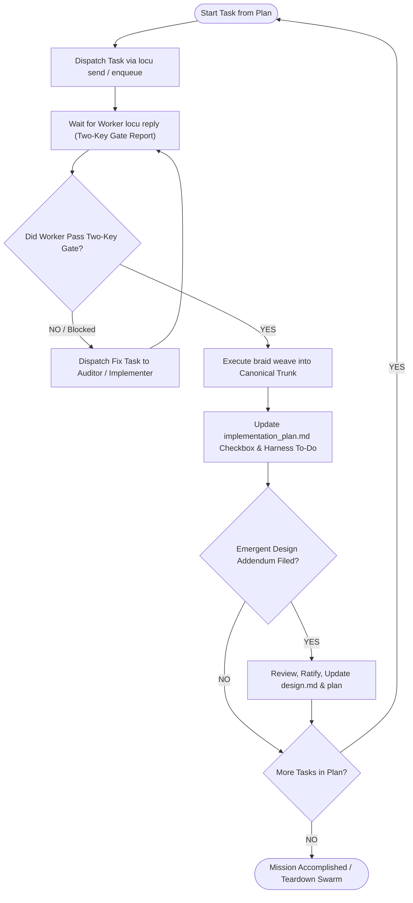

# `orchestrate-swarm`: Main-Chat Swarm Governance & Trunk Integration

> **The Sovereign Conductor of Autonomous Execution**  
> *The Supreme Orchestrator does not write the low-level code lines; it directs the symphony. It dispatches work over Redis, unblocks dependencies, enforces the Two-Key Gate, and weaves clean strands into the trunk.*

---

## 1. The Role of the Supreme Orchestrator

The main chat session assumes the role of **Supreme Orchestrator**:
- **Non-Interference**: Never perform massive multi-file edits directly when workers are active in isolated strands.
- **Strict Transport Discipline**: All task assignments, handoffs, and cancellation interrupts flow exclusively over the Locu Redis bus (`locu send`, `locu reply`, `locu enqueue`).
- **Gated Integration**: Never run `git merge` directly. Only weave branches that have passed both Key 1 (mechanical merge-tree) and Key 2 (live compiler/tests) inside their Braid strands.

---

## 2. The Runtime Governance Loop



---

## 3. Standard Operating Procedures

### SOP 1: Dispatching Tasks to Workers
Depending on the task distribution model in `implementation_plan.md`:

- **Direct Assignment (O2O)**:
  ```bash
  locu send --to architect \
    --subject "Task 1.1: Core Data Structures" \
    --body '{"task_id": "task-core-ds", "instructions": "Implement AST node kinds and message serializers. Use braid strand.", "strand": "strand/task-core-ds"}'
  ```

- **Competing-Consumers Work Queue**:
  ```bash
  locu enqueue queue:myproject:tasks \
    --subject "Task 1.2: Test Harness" \
    --body '{"task_id": "task-test-harness", "strand": "strand/task-test-harness"}'
  ```

### SOP 2: Monitoring Swarm Health & Heartbeats
Check active workers and ensure no listener has stalled or timed out:
```bash
locu who --json
```

If a worker is waiting for a lease or has held a lock too long, inspect its active tmux pane:
```bash
tmux capture-pane -p -t agora-<project>:1 | tail -n 25
```

### SOP 3: Verifying Two-Key Gate & Weaving
When a worker replies indicating task completion:
```json
{
  "status": "gate_passed",
  "task_id": "task-core-ds",
  "branch": "strand/task-core-ds",
  "strand_path": "/Users/eek/Development/workspaces/myproject/task-core-ds/myproject",
  "key1_mechanical": "PASS",
  "key2_semantic": "PASS"
}
```

The Orchestrator verifies and integrates:
```bash
# 1. Weave the verified strand into main
braid weave

# 2. Release any held fencing locks if applicable
locu unlock file:src/types.nim
```

### SOP 4: Updating Dynamic Progress Checklists
Immediately after weaving:
1. Update `implementation_plan.md`:
   - Change `- [ ] **Task 1.1: ...**` to `- [x] **Task 1.1: ...**`.
2. Update the harness's native To-Do / Task tracking tool (e.g. marking the step completed).

### SOP 5: Handling Emergent Design Addenda
If an incoming message contains `[DESIGN ADDENDUM]`:
1. Read the drafted addendum: `view_file(AbsolutePath="docs/addenda/addendum_<topic>.md")`.
2. Evaluate trade-offs (performance, API impact, scope).
3. If approved:
   - Append addendum section to `design.md`.
   - Adjust downstream tasks in `implementation_plan.md`.
   - Reply to worker: `locu reply --to <worker> --subject "Addendum Approved" --body "Proceed with modified design."`.
4. If rejected:
   - Reply with counter-guidance and instruct the worker to remain aligned with original specs.

---

## 4. Swarm Conclusion & Teardown

When all checkboxes in `implementation_plan.md` are marked `- [x]`:
1. Run final repository-wide test suite and linter on the canonical trunk.
2. Gracefully deregister all swarm agents:
   ```bash
   for worker in $(python3 -c "import json; [print(w['name']) for w in json.load(open('agora-swarm.json'))['workers']]"); do
     locu close "$worker" 2>/dev/null || true
   done
   ```
3. Kill the tmux session:
   ```bash
   tmux kill-session -t agora-<project> 2>/dev/null || true
   ```
4. Output the final executive summary to the human operator.
